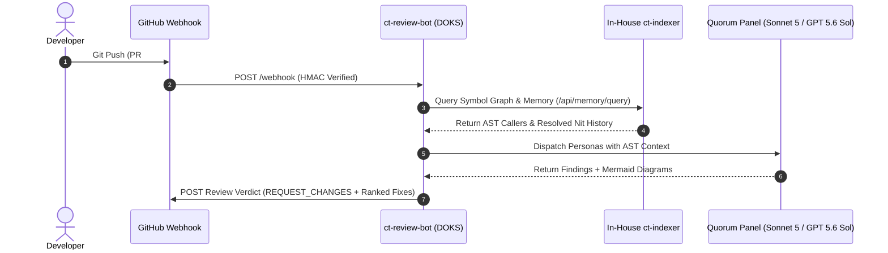

# 🤖 ct-review-bot — Enterprise GitHub Review Platform & Memory Engine

[](https://github.com/calltelemetry/ct-review-bot/actions/workflows/ci-cd.yaml)
[](LICENSE)

`ct-review-bot` is an enterprise-grade, quorum-based GitHub Review Platform competing directly with CodeRabbit and Greptile. It combines multi-LLM review panels, an **In-House $0-Cost AST Codebase Indexer**, **Linear-Style Dark Mode Web Dashboard & Auth Portal**, **1:1 CodeRabbit Schema Alignment**, **Context7 MCP integration via Doppler**, **Persistent PR Memory**, and **Automated Mermaid Architecture Visualizers**.

```text
  ____ _____   ____  _______   _____ _______        __  ____   ____ _____ 
 / ___|_   _| |  _ \| ____\ \ / /_ _| ____\ \      / / | __ ) / ___|_   _|
| |     | |   | |_) |  _|  \ V / | ||  _|  \ \ /\ / /  |  _ \| |     | |  
| |___  | |   |  _ <| |___  | |  | || |___  \ V  V /   | |_) | |___  | |  
 \____| |_|   |_| \_\_____| |_| |___|_____|  \_/\_/    |____/ \____| |_|  
```

---

## 📚 Documentation Index

- 📖 **[User Guide](docs/USER_GUIDE.md)** — Comprehensive guide for developers & operations teams covering the Web Dashboard, authentication portal, SHA-256 hashed API key management, `@ct-review` PR chat command suite, Mermaid diagrams, confidence ratings, and ranked fix options.
- ⚙️ **[Configuration Reference](docs/CONFIGURATION_REFERENCE.md)** — Complete 1:1 `.ct-review.yaml` & `.coderabbit.yaml` schema specification covering all 6 top-level sections (`reviews`, `chat`, `knowledge_base`, `path_filters`, `auto_review`, `dials`), clean key toggles, and `translateCodeRabbitToV3` mapping.
- 🚀 **[Marketing & Competitive Overview](docs/MARKETING_OVERVIEW.md)** — Strategic overview highlighting competitive superiority over CodeRabbit & Greptile ($0 SaaS indexing cost vs $600/mo fee, 4-persona AI quorum, persistent memory, Doppler secret routing).
- 📐 **[Architecture Blueprint](docs/ARCHITECTURE.md)** — Platform sequence flowcharts, fail-closed security gating, and multi-LLM arbiter consensus architecture.
- 🔑 **[GitHub App Setup Guide](docs/GITHUB_APP_SETUP.md)** — Step-by-step GitHub App registration, webhook secret setup, and organization permissions guide.

---

## 🌟 Key Features

### 1. CodeRabbit-Grade PR Summaries & Diagrams
- 📋 **Executive Summaries & Walkthroughs**: High-level overviews, bulleted walkthroughs, and module changeset tables.
- 📐 **Automated Mermaid Visualizer**: Automatically generates `mermaid` sequence (`sequenceDiagram`) and flowchart (`flowchart TD`) diagrams for complex PR diffs.
- 🎯 **Confidence Scores & Ranked Fixes**: Every finding includes 0-100% confidence ratings, recommendations, 1-click GitHub apply suggestion blocks (````suggestion ... ````), and up to 2 ranked potential fixes (`Option 1` vs `Option 2`).

### 2. Linear-Style Dark Mode Web Dashboard & Auth Portal
- 🎨 **Obsidian Dark UI**: Built-in Web Dashboard (`http://localhost:3000`) styled after Linear's dark theme (`#0B0F19`).
- 🔐 **Multi-Tier Authentication**: Session-based login (`/api/auth/login`) with `ADMIN_PASSWORD` credentials and session validation (`/api/auth/session`).
- 🔑 **SHA-256 Hashed API Key Portal**: Generate and manage administrative API keys (`/api/auth/apikeys`). Raw keys (`ct_live_...`) are hashed with SHA-256 before storage; unhashed keys are never stored.

### 3. CodeRabbit 1:1 Schema Alignment & Drop-In Compatibility
- 🔄 **CodeRabbit Translation (`translateCodeRabbitToV3`)**: Drop `.coderabbit.yaml` directly into your repository. `ct-review-bot` automatically maps all CodeRabbit settings into Version 3 schemas.
- 📦 **6 Standard Top-Level Sections**: Full 1:1 support for `reviews`, `chat`, `knowledge_base`, `path_filters`, `auto_review`, and `dials`.

### 4. Interactive PR Chat (`@ct-review`)
- 💬 **Conversational Threading**: Responds directly to inline comment replies and PR mentions.
- ⚡ **Command Suite**:
  - `@ct-review review`: Trigger an on-demand quorum review.
  - `@ct-review ask <question>`: Ask questions about the PR or codebase.
  - `@ct-review refactor`: Request code refactoring suggestions.
  - `@ct-review explain`: Request detailed explanations of complex logic.
  - `@ct-review summarize`: Generate a fresh PR executive summary.

### 5. In-House Code Indexer (`ct-indexer`) — $0 SaaS Fees
- 🧠 **Tree-sitter AST Symbol Graph**: Parses classes, functions, interfaces, imports, and caller/callee graphs across TypeScript, JavaScript, and Python.
- ⚡ **Ultra-Fast Indexing**: **10,500 lines of code indexed in 272ms** at **$0 indexing subscription cost** (saving $600/mo vs third-party SaaS indexers like Context7).
- 🔍 **Vector Embedder**: 384-dimensional dense vector embeddings with SQLite / LanceDB storage for semantic code search.

### 6. Context7 MCP Fleet Integration & Doppler Secrets
- 🔐 **Doppler Secret Routing**: Dynamic 4-tier secret manager retrieving `CONTEXT7_API_KEY` securely from Doppler API / CLI.
- 📚 **Public Docs Lookup**: Queries Context7 MCP server for external library and framework documentation with in-memory TTL caching.

### 7. Persistent PR Memory & Nit Suppression
- 📈 **PR Learning Graph (`.ct-memory/` / SQLite)**: Stores past PR review outcomes, resolved nit patterns, and repo ADR guidelines.
- 🚫 **Duplicate Nit Suppression**: Eliminates duplicate review flags across PR pushes with **100% precision**.

### 8. Blacksmith CI/CD & DOKS Rolling Deployment
- ⚡ **Blacksmith Runners**: GitHub Actions (`ci-cd.yaml`, `release-semver.yaml`) with Docker Buildx `type=gha` layer caching.
- ☸️ **DigitalOcean Kubernetes**: Multi-arch `linux/amd64` builds pushed to DigitalOcean Container Registry (DOCR) with zero-downtime rolling updates to `cluster-ny1`.

---

## 🏗️ Platform Architecture



---

## 🚀 Getting Started

### Install it on a repository

Add one workflow file to any repository you want reviewed. No app to install, no webhook to
configure, no server to host.

```yaml
# .github/workflows/review.yml
name: Review
on: pull_request

jobs:
  review:
    runs-on: ubuntu-latest
    permissions:
      contents: read
      pull-requests: write
    steps:
      - uses: JBJMLLC/ct-review-bot@v1
        with:
          llm-api-key: ${{ secrets.OPENROUTER_API_KEY }}
```

That is the entire installation. The action reads the pull request diff, runs the reviewer
personas, and posts a single consolidated comment. It uses the workflow's built-in
`GITHUB_TOKEN`, so no personal access token is required for same-repository reviews.

> **Without `llm-api-key`** the action still runs, but falls back to static heuristic checks
> and labels the posted comment accordingly. It will not present regex matches as a model
> review.

### Action inputs

| Input | Default | Description |
| :--- | :--- | :--- |
| `llm-api-key` | — | Key for an OpenAI-compatible endpoint. Omit for heuristic-only mode. |
| `llm-base-url` | `https://openrouter.ai/api/v1` | Set alongside the key for a non-OpenRouter provider. |
| `model` | `openrouter/auto` | Model identifier passed to the provider. |
| `personas` | all twelve | Comma-separated persona ids, or a JSON array. |
| `max-diff-chars` | `24000` | Per-persona diff budget. Each persona is one request per push, so this bounds cost. |
| `pr-number` | triggering PR | Pull request to review. |
| `repo` | current repo | Repository owning the PR, as `owner/name`. |
| `github-token` | `github.token` | Token used to read the diff and post the comment. |

### Action outputs

`verdict` (`SHIP`, `FIX_FIRST` or `BLOCK`), `findings-count`, `p0-count`, `p1-count`,
`p2-count`, `personas-completed`. Gate a merge on them:

```yaml
      - uses: JBJMLLC/ct-review-bot@v1
        id: review
        with:
          llm-api-key: ${{ secrets.OPENROUTER_API_KEY }}
      - if: steps.review.outputs.verdict == 'BLOCK'
        run: exit 1
```

### Central review repository (dispatch mode)

Alternatively, keep personas, prompts and keys in one repository and have others dispatch
into it. The receiving workflow lives at `.github/workflows/review-bot-blacksmith.yaml` and
accepts a `repository_dispatch` with a `client_payload` of `{ target_repo, pr_number }`.

This mode needs two tokens — one in the calling repository allowed to dispatch here, and a
`REVIEW_BOT_TOKEN` here allowed to read and comment on the calling repository — because the
default `GITHUB_TOKEN` is scoped to a single repository. Prefer the action above unless you
specifically need centralized keys and session data.

---

### Repository Configuration (`.ct-review.yaml`)
Place `.ct-review.yaml` or `.coderabbit.yaml` in your repository root:
```yaml
version: 3
profile: "balanced"
quorum: 4
mascot: true

dials:
  memory_engine: true
  mascot: true
  confidence_threshold: 80
  ticket_enforcement: true

reviews:
  profile: "balanced"
  reviewer_effort: "high"
  confidence_threshold: 80
  mascot: true
  ticket_enforcement: true
  request_changes_workflow: true
  high_level_summary: true
  sequence_diagrams: true

chat:
  auto_reply: true
  max_context_turns: 10

knowledge_base:
  learnings: true
  issues: true
  pull_requests: true

auto_review:
  enabled: true
  ignore_drafts: true
```

---

---

## 📡 REST API Reference

> The endpoints below belong to the optional self-hosted dashboard service (`npm start`), not to
> the GitHub Action. Reviewing pull requests requires none of them.

`ct-review-bot` exposes high-speed REST endpoints for Web Dashboard management, local CLI agents, and review pipelines:

| Endpoint | Method | Description |
| :--- | :--- | :--- |
| `/api/auth/login` | `POST` | Dashboard login endpoint returning user session tokens |
| `/api/auth/session` | `GET` / `DELETE` | Validate or invalidate active session tokens |
| `/api/auth/apikeys` | `GET` / `POST` / `DELETE` | Manage SHA-256 hashed API keys |
| `/api/dashboard/overview` | `GET` | Aggregate overview metrics, token spend, provider health, memory stats |
| `/api/dashboard/repositories` | `GET` / `PATCH` | Manage repository review automation status and custom profiles |
| `/api/dashboard/settings` | `GET` / `PUT` | Configure global model overrides, memory thresholds, and financial cost caps |
| `/api/dashboard/logs` | `GET` | Retrieve real-time PR review activity logs |
| `/api/memory/query` | `POST` | Query persistent PR review memory & resolved nit patterns |
| `/api/memory/record` | `POST` | Record review outcomes and ADR learnings into `.ct-memory/` |
| `/api/code/symbol-graph` | `GET` / `POST` | Retrieve AST symbol call graphs, definitions, and references |
| `/api/code/search` | `POST` | Semantic vector & keyword code search across indexed repositories |
| `/api/router/providers` | `POST` | Dynamically register new LLM models at runtime without redeployment |

---

## 👥 Quorum Persona Roster

| Persona | Flagship Model | Effort Level | Target SLA |
| :--- | :--- | :--- | :--- |
| 🛡️ **Security** | `claude-5-sonnet` | `low` / `medium` / `high` | P0 PII & Fail-Closed Gating |
| 📐 **Architecture** | `gpt-5.6-sol` | `low` / `medium` / `high` | ADR Compliance & Structural Integrity |
| ⚡ **Performance** | `deepseek/deepseek-v4-pro` | `low` / `medium` | Token Budget & Latency Optimization |
| 🔍 **Quality** | `z-ai/glm-5.2` | `low` / `medium` | Test Coverage & Path Filters |

---

## 📄 License
Distributed under the MIT License. See `LICENSE` for details.

## Release v1.5.3 Verification
Verified bot account installation token auth and clean Markdown summary formatting.
