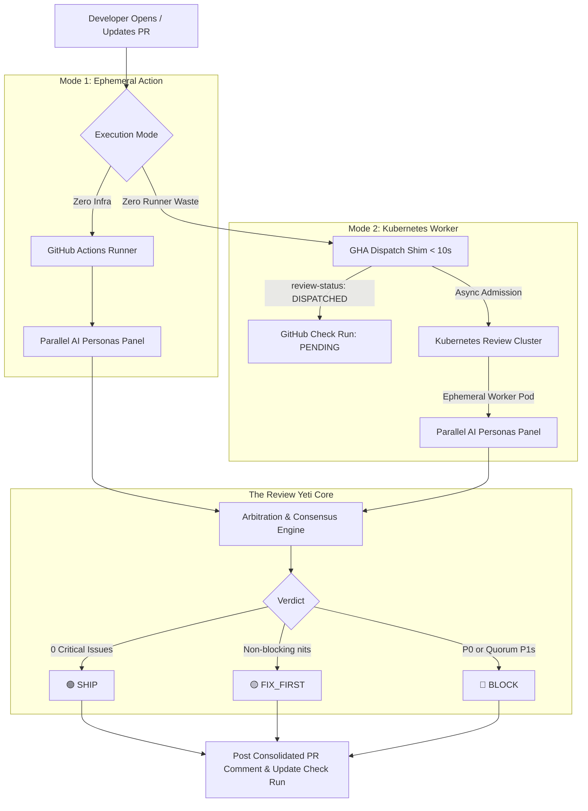

# 🏔️ Review Yeti

[](https://github.com/review-yeti-ai/review-yeti-bot/actions/workflows/review-bot.yaml)
[](LICENSE)
[](https://github.com/marketplace/actions/review-yeti-ai)
[](docs/KUBERNETES_MODE.md)

**Autonomous Multi-Persona AI Code Review Panel for GitHub Pull Requests.**

Review Yeti convenes a panel of specialized AI reviewers—each with a dedicated charter (Security, Performance, Architecture, Quality, Dependencies)—evaluating pull request diffs in parallel, reconciling findings through automated arbitration, and posting **one consolidated, actionable review comment** and native **GitHub Check Run**.

---

## ✨ Features at a Glance

- 👥 **Multi-Persona Review Panel**: Dedicated reviewers for Security & Tenancy, System Architecture, Performance, QA & Testing, and Dependency Safety.
- ⚖️ **Binding Arbitration Engine**: Automated moderator and arbiter that deduplicate findings and deliver clear verdicts: `SHIP`, `FIX_FIRST`, or `BLOCK`.
- ⚡ **Dual Execution Engines**:
  - **Ephemeral Action Mode**: Zero infrastructure, 60-second setup directly in GitHub Actions.
  - **Kubernetes Worker Mode**: Dispatches reviews to K8s pods in **< 10 seconds**, eliminating 95%+ of billable runner minute waste.
- 🔐 **Base-Ref Trust Boundary**: Charters and policies are loaded strictly from the target base branch (`main`), preventing PRs from tampering with their own review rules.
- 🎯 **Zero Diff Hallucinations**: Automated filter discards any finding referencing code outside the PR's modified hunks.
- 🌐 **Model & Provider Agnostic**: Works with OpenRouter, Anthropic, OpenAI, DeepSeek, or self-hosted Ollama/vLLM endpoints.

---

## 🏗️ Architecture Overview



---

## ⚡ Quickstart: 5-Minute GitHub Action

Add a single workflow file to any repository:

```yaml
# .github/workflows/review-yeti.yml
name: Review Yeti
on:
  pull_request:
    types: [opened, synchronize, reopened, ready_for_review]

jobs:
  review:
    runs-on: ubuntu-latest
    permissions:
      contents: read
      pull-requests: write
    steps:
      - name: Run Review Yeti
        uses: review-yeti-ai/review-yeti-bot@v1
        with:
          llm-base-url: https://openrouter.ai/api/v1
          model: deepseek/deepseek-v4-flash-0731
          llm-api-key: ${{ secrets.OPENROUTER_API_KEY }}
```

> [!TIP]
> **No `actions/checkout` required!** Review Yeti fetches the PR diff and base branch charters directly over the GitHub API, saving checkout time and bandwidth.

---

## ☸️ Scale-Out: Kubernetes & DOKS Execution Mode

For teams with high PR volume, running 5+ personas inside GitHub Actions runners can accumulate costly billable runner minutes. 

Review Yeti's **Kubernetes Mode** uses an asynchronous dispatch handshake:
1. The GitHub Action acts as a lightweight shim, calls your Kubernetes cluster, and exits in **< 10 seconds**.
2. The Action registers an initial check run: `review-status: DISPATCHED`, `gate-decision: PENDING`.
3. An ephemeral worker pod in your Kubernetes cluster processes the review, posts the PR review comment, and updates the GitHub Check Run to `success` or `failure` directly using its GitHub App token.

```yaml
# .github/workflows/review-yeti-k8s.yml
jobs:
  review:
    runs-on: ubuntu-latest
    permissions:
      contents: read
      pull-requests: read
      checks: write
    steps:
      - name: Dispatch to Kubernetes Review Cluster
        uses: review-yeti-ai/review-yeti-bot@v1
        with:
          execution-backend: doks  # or generic kubernetes
          dispatch-url: https://review-bot.example.com/api/admission/dispatch
          dispatch-token: ${{ secrets.REVIEW_DISPATCH_SECRET }}
```

👉 **Read the complete [Kubernetes & DOKS Execution Guide](docs/KUBERNETES_MODE.md)**.

---

## 📊 What You Get: Consolidated PR Review Comment

Review Yeti posts a single, clean markdown review comment summarizing all personas:

> ## 🟡 **Verdict: FIX_FIRST**
>
> ### 📊 AI Review Panel Summary
> - **Repository**: `my-org/checkout-service`
> - **Commit SHA**: `a1b2c3d`
> - **Review Mode**: Model-backed (`deepseek/deepseek-v4-flash-0731`)
> - **Parallel Personas Evaluated**: `5/5`
> - **Quorum Status**: `SATISFIED`
> - **Total Findings**: P0: `0` | P1: `1` | P2: `2`
> - **Rationale**: Changes requested for 1 P1 finding(s) and 2 P2 nit(s).
>
> ### 📋 Persona Evaluation Roster
> | Reviewer Persona | Model | Decision | Findings |
> |---|---|---|---|
> | 🛡️ Security & Tenancy Guardian | `deepseek/deepseek-v4-flash-0731` | ⚠️ FINDINGS | 1 |
> | ⚡ Performance & Scalability Specialist | `deepseek/deepseek-v4-flash-0731` | ✅ APPROVE | 0 |
> | 🏛️ System Architecture & Design | `deepseek/deepseek-v4-flash-0731` | ⚠️ FINDINGS | 2 |
> | 🧪 Testing & Quality Assurance | `deepseek/deepseek-v4-flash-0731` | ✅ APPROVE | 0 |
> | 📦 Dependency Safety & Supply Chain | `deepseek/deepseek-v4-flash-0731` | ✅ APPROVE | 0 |
>
> **🛡️ Security & Tenancy Guardian (1 finding)**
>
> | Severity | Path | Line | Title | Suggestion |
> |---|---|---|---|---|
> | 🟠 P1 | `src/api/orders.ts` | 42 | **Order lookup not scoped to tenant** | Add `orgId` to the where clause. |

---

## 👥 The Reviewer Persona Roster

### Built-in Personas (On by Default)
- 🛡️ **`security`**: SQL injection, authorization bypass, secret leakage, OWASP top 10, multi-tenant isolation.
- ⚡ **`performance`**: N+1 queries, unindexed filters, thread blocking, memory leaks, high complexity loops.
- 🏛️ **`architecture`**: Layering violations, interface segregation, tight coupling, anti-patterns.
- 🧪 **`testing`**: Edge cases, missing assertions, negative testing, test coverage for modified code.
- 📦 **`dependencies`**: Vulnerable packages, supply-chain safety, deprecation risks.

### Optional Specialists (Opt-in via `.ct-review.yaml`)
- 🗄️ **`database`**: Schema migrations, lock hazards, transaction isolation.
- 🌐 **`accessibility`**: WCAG compliance, screen reader support, semantic markup.
- 🎨 **`style`**: Idiomatic conventions, readability, clarity.
- 📄 **`documentation`**: Public API documentation, docstrings, change notes.
- 🚀 **`devops`**: Dockerfile best practices, Kubernetes configs, CI/CD scripts.
- 🌍 **`i18n`**: Hardcoded UI strings, localization safety.
- ⚖️ **`licensing`**: Open-source license compatibility.

```yaml
# Select specific personas in action inputs:
with:
  personas: security,performance,database
```

---

## ⚖️ How Verdicts & Merge Gates Work

| Verdict | Condition | GitHub Check Run Status | Description |
| :--- | :--- | :--- | :--- |
| **`SHIP`** 🟢 | 0 P0s, 0 P1s, minimal P2s | `success` | Approved. Safe to merge! |
| **`FIX_FIRST`** 🟡 | 0 P0s, 1+ P1s (or high P2 volume) | `neutral` / `failure` | Non-blocking recommendations to resolve before release. |
| **`BLOCK`** 🔴 | 1+ P0s, or P1 quorum reached | `failure` | Merge blocked until critical issues are fixed. |

---

## 🛠️ Customizing Reviewers for Your Codebase

### 1. Repository Configuration (`.ct-review.yaml`)

Define enabled personas, diff limits, and path filters at your repository root:

```yaml
# .ct-review.yaml
version: 3

personas:
  - id: security
  - id: database
    enabled: true
  - id: style
    enabled: false
  - id: tenancy
    name: "🏢 Multi-Tenant Isolation"
    charter: |
      Every query touching tenant data must include orgId. Flag any query missing this scope.

path_filters:
  - "dist/**"
  - "node_modules/**"
  - "package-lock.json"
```

### 2. Standalone Markdown Charters (`.ct-review/personas/*.md`)

Create longer, detailed persona charters in Markdown files under `.ct-review/personas/`:

```markdown
<!-- .ct-review/personas/tenancy.md -->
---
name: "🏢 Multi-Tenant Isolation Guardian"
---

Every database query that touches customer data must be scoped by `orgId`.

## What to flag:
- Repository methods accepting a raw `id` without a tenant bound.
- Raw SQL queries missing a `WHERE org_id = $n` clause.
- Cache keys omitting tenant prefixes.

## What to ignore:
- Admin routes under `src/admin/**`.
- Database migrations.
```

> [!IMPORTANT]
> **Base-Branch Authority**: Review Yeti loads configuration and charters from the pull request's **base branch** (e.g. `main`). Changes made to reviewer configurations within a PR take effect only **after** that PR is merged, ensuring review integrity.

---

## 🔐 GitHub App Setup (Recommended)

While basic reviews work with the built-in `GITHUB_TOKEN`, setting up a **GitHub App** is strongly recommended for:
- 🚀 **15,000 req/hr** independent rate limit.
- 🏷️ **Native GitHub Check Runs** API access (`checks:write`).
- 🔒 **Short-lived RS256 JWT `ghs_` tokens** (no long-lived personal access tokens).

👉 **Follow the step-by-step [GitHub App Setup Guide](docs/GITHUB_APP_SETUP.md)**.

---

## 💻 Running Locally via CLI

You can run Review Yeti directly from your terminal to inspect diffs or test personas locally:

```bash
# 1. Review local uncommitted changes
git diff origin/main...HEAD > /tmp/changes.diff

PR_DIFF_FILE=/tmp/changes.diff \
PR_NUMBER=1 \
GITHUB_REPOSITORY="my-org/my-repo" \
OPENROUTER_API_KEY="sk-or-v1-..." \
node .github/workflows/pipelines/review-pipeline.js
```

---

## 📚 Documentation Index

- 🚀 **[Onboarding Guide](docs/ONBOARDING_GUIDE.md)** — Getting started, deployment patterns, and branch protection.
- 🔐 **[GitHub App Setup](docs/GITHUB_APP_SETUP.md)** — Step-by-step GitHub App registration and permissions matrix.
- ☸️ **[Kubernetes & DOKS Mode](docs/KUBERNETES_MODE.md)** — Offloading reviews to Kubernetes worker pods.
- 🏛️ **[Architecture Specification](docs/ARCHITECTURE.md)** — Pipeline design, arbitration engine, and trust boundaries.
- ⚙️ **[Configuration Reference](docs/CONFIGURATION_REFERENCE.md)** — Complete schema for `.ct-review.yaml`.
- 💻 **[Running Locally via CLI](docs/RUNNING_LOCALLY.md)** — Testing reviews and benchmarks in your terminal.
- 📦 **[Releasing Guide](docs/RELEASING.md)** — SemVer releases and Release Please workflows.

---

## 📄 License

Distributed under the MIT License. See [LICENSE](LICENSE) for details.
