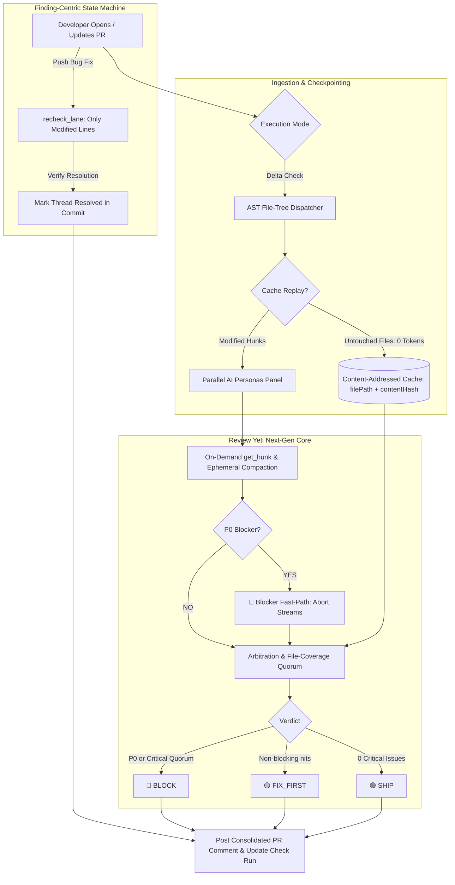

# 🏔️ Review Yeti

[](https://github.com/review-yeti-ai/review-yeti-bot/actions/workflows/review-bot.yaml)
[](LICENSE)
[](https://github.com/marketplace/actions/review-yeti-ai)
[](docs/KUBERNETES_MODE.md)
[](charts/review-yeti)
[](examples)

**Autonomous Multi-Persona AI Code Review Panel for GitHub Pull Requests.**

Review Yeti convenes a panel of specialized AI reviewers—each with a dedicated charter (Security, Performance, Architecture, Quality, Dependencies)—evaluating pull request diffs in parallel, reconciling findings through automated arbitration, and posting **one consolidated, actionable review comment** and native **GitHub Check Run**.

> [!TIP]
> 🚀 **Explore Pre-Built Resources**:
> - **[Official Helm 3 Chart](charts/review-yeti/)** & **[Helm Operations Guide](docs/HELM_GUIDE.md)** for production Kubernetes clusters.
> - **[Cloudflare Portal Setup Guide](docs/CLOUDFLARE_PORTAL_SETUP.md)** to deploy the management and analytics portal to Cloudflare.
> - **[Examples Gallery](examples/)** featuring 6 production workflows, 4 configuration profiles, and custom persona charters.
> - **[Production Troubleshooting Guide](docs/TROUBLESHOOTING.md)** for triage and incident resolution.

---

## ✨ Features at a Glance

- 🖥️ **Interactive Web Portal & Analytics Dashboard**: Modern web interface featuring Live Review Inspector with real-time SSE reasoning traces, Executive & Engineering spend analytics, GitHub OAuth repository management, and Human-in-the-Loop verdict overrides ([Cloudflare Guide](docs/CLOUDFLARE_PORTAL_SETUP.md)).
- 👥 **Multi-Persona Review Panel**: Dedicated reviewers for Security & Tenancy, System Architecture, Performance, QA & Testing, and Dependency Safety.
- 🔄 **Finding-Centric Incremental State Machine**: Decouples coverage verification from verdicts. When fixing prior blocking findings, Review Yeti routes only the modified lines to `recheck_lane` and auto-resolves fixed threads with commit references, eliminating whole-PR re-reviews and finding churn.
- 🌐 **Unbounded AST Streaming & Diff Compaction (No 25k Wall)**: Eliminates monolithic diff prefill and artificial 25k token ceilings. Personas inspect path-bounded AST outlines, fetch hunks on-demand (`get_hunk`), and evict raw diffs post-turn (`[DIFF_EVICTION_RECEIPT]`), maintaining a flat token footprint (<86 tok/turn) and scaling across multi-megabyte enterprise PRs.
- ⚡ **Content-Addressed Subtask Checkpoints**: Reviewer task checkpoints key on `(filePath, contentHash, laneId)`. Routine `git rebase`, squashing, and amends replay cached reviewer outputs for all untouched files in **0 GPU tokens** and ~1-2ms.
- 🛑 **Blocker Fast-Path Quorum**: Default `file_coverage` quorum mode halts remaining exploratory/style lanes immediately upon discovering any verified P0 blocker, aborting active model streams via `taskAbort.abort()` to surface blockers in seconds.
- 🔍 **Deterministic Pre-Check Engine & SAST Candidate Hypotheses**:
  - **Zoekt Cross-File Symbol Discovery**: Deterministically queries code symbols across repository indexes to discover call sites, definitions, and types before persona evaluation turns.
  - **Zero-Compilation Sandbox Analyzers**: Executes fast, compilation-free static analyzers (`eslint`, `semgrep`, `gitleaks`) on modified PR hunks. Outputs are formatted as structured candidate hypotheses that personas verify, eliminating SAST false positives while isolating documentation and license lanes.
- ⚡ **Native Apply Suggestions**: Automatic reviews can include GitHub's **Apply suggestion** button for complete, self-contained fixes. Single-line and multiline replacements preserve indentation and support deletions. Suggestions are attached only to validated new-file diff ranges; uncertain fixes, file-level findings, and architectural advice remain prose. All severities publish inline; P2 findings do not change the verdict. A single sticky overview replaces its contents on each push or rerun, without accumulating verdict comments or history.
- 💬 **Interactive PR Chat Mentoring**: Mention `@review-yeti explain`, `@review-yeti fix`, `@review-yeti ignore`, or `@review-yeti mute` in review threads ([Guide](docs/INTERACTIVE_CHAT.md)).
- 💻 **Local Pre-Commit CLI & Git Hook**: Evaluate staged changes in < 5s with sub-10ms credential detection and blocking P0 checks via `git yeti pre-commit` ([Guide](docs/CLI_REFERENCE.md)).
- 🧙 **30-Second GitHub App Setup Wizard**: Automated onboarding via GitHub App Manifest Flow (`npx review-yeti init`) with least-privilege security and `.env` generation ([Guide](docs/CLI_REFERENCE.md#review-yeti-init-30-second-setup-wizard)).
- 👥 **Community Persona Store**: Reference and compose external persona charters across repositories using `uses: ...` ([Guide](docs/TEAM_MEMORY.md#community-persona-store--charter-loader)).
- 🧠 **Persistent Team Memory**: SQLite WAL database (`.ct-memory/team_memory.db`) that suppresses repetitive false-positive nits while enforcing non-bypassable P0/P1 security gates ([Guide](docs/TEAM_MEMORY.md)).
- ⚖️ **Binding Arbitration Engine**: Automated moderator and arbiter that deduplicate findings and deliver clear verdicts: `SHIP`, `FIX_FIRST`, or `BLOCK`.
- 🛰️ **Private JetStream Event Plane & Outbox**: Decoupled, auditable lifecycle event stream (`review-yeti-event.v1`) with transactional PostgreSQL outbox, monotonic ULIDs, and 18-field recursive sanitizer ([Architecture](docs/ARCHITECTURE.md#private-jetstream-event-plane--transactional-outbox-api-3230--adr-0564)).
- 📊 **Enterprise Observability & Monotonic Metrics**: Full VictoriaMetrics integration (20 active targets UP), monotonic cumulative Prometheus counters (REL-817), 5 Alertmanager SLO rules, and a dedicated 16-panel Grafana operations dashboard (`review-yeti-ops.json`) ([Guide](docs/DOKS_REVIEW_OPERATIONS.md#observability-opentelemetry--victoriametrics)).
- 🚀 **Sub-Minute Modular DAG Reviews**: High-throughput DOKS worker execution with ephemeral `emptyDir` storage (0 PVC delay)—13s fast-ship doc reviews and 59s 5-lane parallel DAG reviews ([Benchmarks](docs/DOKS_REVIEW_OPERATIONS.md#live-doks-qualification-evidence)).
- ⚡ **Dual Execution Engines**:
  - **Ephemeral Action Mode**: Zero infrastructure, 60-second setup directly in GitHub Actions.
  - **Kubernetes Worker Mode**: Dispatches reviews to K8s pods in **< 10 seconds**, eliminating 95%+ of billable runner minute waste.
- 🔐 **Base-Ref Trust Boundary**: Charters and policies are loaded strictly from the target base branch (`main`), preventing PRs from tampering with their own review rules.
- 🎯 **Zero Diff Hallucinations**: Automated filter discards any finding referencing code outside the PR's modified hunks.
- 🌐 **Model & Provider Agnostic**: Works with OpenRouter, Anthropic, OpenAI, DeepSeek, or self-hosted Ollama/vLLM endpoints.

---

## 🏗️ Architecture Overview


```mermaid
graph TD
    PR[Developer Opens / Updates PR] --> Choice{Execution Mode}

    subgraph Ingestion & Checkpointing
        Choice -->|Delta Check| Diff[AST File-Tree Dispatcher]
        Diff --> CacheCheck{Cache Replay?}
        CacheCheck -->|Untouched Files: 0 Tokens| Replay[(Content-Addressed Cache: filePath + contentHash)]
        CacheCheck -->|Modified Hunks| Dispatch[Parallel AI Personas Panel]
    end

    subgraph Review Yeti Next-Gen Core
        Dispatch --> Tool[On-Demand get_hunk & Ephemeral Compaction]
        Tool --> FastPath{P0 Blocker?}
        FastPath -->|YES| EarlyExit[🛑 Blocker Fast-Path: Abort Streams]
        FastPath -->|NO| Arb[Arbitration & File-Coverage Quorum]
        Replay --> Arb
        EarlyExit --> Arb
        Arb --> Verdict{Verdict}
        Verdict -->|0 Critical Issues| Ship[🟢 SHIP]
        Verdict -->|Non-blocking nits| Fix[🟡 FIX_FIRST]
        Verdict -->|P0 or Critical Quorum| Block[🔴 BLOCK]
    end

    subgraph Finding-Centric State Machine
        PR -->|Push Bug Fix| Recheck[recheck_lane: Only Modified Lines]
        Recheck -->|Verify Resolution| Resolve[Mark Thread Resolved in Commit]
    end

    Ship --> Output[Post Consolidated PR Comment & Update Check Run]
    Fix --> Output
    Block --> Output
    Resolve --> Output
```

---

## 🖥️ Interactive Management Portal & Dashboard

Review Yeti includes an interactive web portal for engineering teams, security leads, and executives. The hosted URLs below are deployment examples; replace them with your own origin:

| View | Production URL | Cloudflare Edge Worker URL | Local URL | Capabilities |
| :--- | :--- | :--- | :--- | :--- |
| 📊 **Executive & Engineering Analytics** | [`https://review-yeti.example.com/analytics`](https://review-yeti.example.com/analytics) | [`https://review-yeti.example.workers.dev/analytics`](https://review-yeti.example.workers.dev/analytics) | `http://localhost:3000/analytics` | Nearest-rank p95 review turnaround latency, token burn curves, model cost per PR/repo, and finding severity ratios (24h/7d/30d). |
| 📡 **Live Review Inspector** | [`https://review-yeti.example.com/live`](https://review-yeti.example.com/live) | [`https://review-yeti.example.workers.dev/live`](https://review-yeti.example.workers.dev/live) | `http://localhost:3000/live` | Real-time SSE persona reasoning stream (`reasoning:chunk`), tool call traces, and interactive diff viewer with line-anchored finding cards. |
| 🏢 **Repository & Review Rules** | [`https://review-yeti.example.com/repos`](https://review-yeti.example.com/repos) | [`https://review-yeti.example.workers.dev/repos`](https://review-yeti.example.workers.dev/repos) | `http://localhost:3000/repos` | GitHub organization discovery, active PR inspection, on-demand review dispatch, and per-repo automated review rule toggles. |
| ⚙️ **Settings & Onboarding** | [`https://review-yeti.example.com/settings`](https://review-yeti.example.com/settings) | [`https://review-yeti.example.workers.dev/settings`](https://review-yeti.example.workers.dev/settings) | `http://localhost:3000/settings` | GitHub App integration, model registry overrides, and platform configuration. |

### ☁️ Serverless Cloudflare Deployment

Because Review Yeti's control plane (Durable Objects, Workflows, Queues, R2) and execution plane already run on Cloudflare Workers (`review-yeti-cf-orchestrator`), the portal is designed to run directly on Cloudflare:
1. **Unified Cloudflare Worker with Static Assets** (Recommended): Serve the Next.js static export (`out/`) directly from Cloudflare's edge using `[assets]` in `wrangler.toml`. Zero origin servers required.
2. **Cloudflare Pages**: Deploy the frontend export standalone to Cloudflare Pages edge CDN, with an API proxy to the Worker.
3. **Cloudflare Tunnel (`cloudflared`)**: For local development or hybrid validation alongside the DOKS Kubernetes operator.

👉 **Read the complete [Cloudflare Portal Setup & Deployment Guide](docs/CLOUDFLARE_PORTAL_SETUP.md)**.

---

## ⚡ Quickstart: 5-Minute GitHub Action

Add a single workflow file to any repository:

```yaml
# .github/workflows/review-yeti.yml
name: Review Yeti
on:
  pull_request:
    types: [opened, synchronize, reopened, ready_for_review]

jobs:
  review:
    runs-on: ubuntu-latest
    permissions:
      contents: read
      pull-requests: write
    steps:
      - name: Run Review Yeti
        uses: review-yeti-ai/review-yeti-bot@v1
        with:
          llm-base-url: https://openrouter.ai/api/v1
          model: deepseek/deepseek-v4-flash-0731
          llm-api-key: ${{ secrets.OPENROUTER_API_KEY }}
```

> [!TIP]
> **No `actions/checkout` required!** Review Yeti fetches the PR diff and base branch charters directly over the GitHub API, saving checkout time and bandwidth.

---

## ☸️ Scale-Out: Kubernetes & DOKS Execution Mode

For teams with high PR volume, running 5+ personas inside GitHub Actions runners can accumulate costly billable runner minutes. 

Review Yeti's **Kubernetes Mode** uses an asynchronous dispatch handshake:
1. The GitHub Action acts as a lightweight shim, admits the review to the Kubernetes worker queue, and exits in **< 10 seconds**.
2. The Action registers an initial check run: `review-status: DISPATCHED`, `gate-decision: PENDING`.
3. An ephemeral worker pod processes the review, posts the PR review comment, and updates the GitHub Check Run to `success` or `failure` directly using its GitHub App token.

```yaml
# .github/workflows/review-yeti-k8s.yml
jobs:
  review:
    runs-on: ubuntu-latest
    permissions:
      contents: read
      pull-requests: read
      checks: write
    steps:
      - name: Dispatch to Kubernetes Review Cluster
        uses: review-yeti-ai/review-yeti-bot@v1
        with:
          execution-backend: doks  # or generic kubernetes
          dispatch-url: https://review-bot.example.com/api/admission/dispatch
          dispatch-token: ${{ secrets.REVIEW_DISPATCH_SECRET }}
```

### 🚀 Kubernetes Worker Chart

Review Yeti provides a production-grade Helm 3 chart in [`charts/review-yeti/`](charts/review-yeti/):

> [!NOTE]
> This chart deploys the components the **hosted** Review Yeti queue runs. The
> Action's dispatch is admitted only for allowlisted callers of that queue, so installing this
> chart into your own cluster will not receive reviews yet. See
> [Kubernetes Mode](docs/KUBERNETES_MODE.md).

```bash
# 1. Add and install Review Yeti using production values
helm install review-yeti charts/review-yeti \
  --namespace review-yeti-system \
  --create-namespace \
  -f examples/k8s/values-doks.yaml
```

Pre-configured cloud values files are available in [`examples/k8s/`](examples/k8s/). They configure the chart for each platform; they do **not** make a cluster you operate reachable by the Action, which is bound to the hosted endpoint:
- **DigitalOcean (DOKS)**: [`examples/k8s/values-doks.yaml`](examples/k8s/values-doks.yaml) (DO LoadBalancer + Block Storage)
- **AWS EKS**: [`examples/k8s/values-eks.yaml`](examples/k8s/values-eks.yaml) (AWS Load Balancer Controller ALB + gp3)
- **Local Dev**: [`examples/k8s/values-local.yaml`](examples/k8s/values-local.yaml) (Minikube / Kind / K3s with local Ollama)

👉 **Read the comprehensive [Helm 3 Operations Guide](docs/HELM_GUIDE.md)**, **[Kubernetes Architecture Specification](docs/KUBERNETES_MODE.md)**, and **[Troubleshooting Guide](docs/TROUBLESHOOTING.md)**.

---

## 📊 What You Get: Consolidated PR Review Comment

Review Yeti posts a single, clean markdown review comment summarizing all personas:

> ## 🟡 **Verdict: FIX_FIRST**
>
> ### 📊 AI Review Panel Summary
> - **Repository**: `my-org/checkout-service`
> - **Commit SHA**: `a1b2c3d`
> - **Review Mode**: Model-backed (`deepseek/deepseek-v4-flash-0731`)
> - **Parallel Personas Evaluated**: `5/5`
> - **Quorum Status**: `SATISFIED`
> - **Total Findings**: P0: `0` | P1: `1` | P2: `2`
> - **Rationale**: Changes requested for 1 P1 finding(s) and 2 P2 nit(s).
>
> ### 📋 Persona Evaluation Roster
> | Reviewer Persona | Model | Decision | Findings |
> |---|---|---|---|
> | 🛡️ Security & Tenancy Guardian | `deepseek/deepseek-v4-flash-0731` | ⚠️ FINDINGS | 1 |
> | ⚡ Performance & Scalability Specialist | `deepseek/deepseek-v4-flash-0731` | ✅ APPROVE | 0 |
> | 🏛️ System Architecture & Design | `deepseek/deepseek-v4-flash-0731` | ⚠️ FINDINGS | 2 |
> | 🧪 Testing & Quality Assurance | `deepseek/deepseek-v4-flash-0731` | ✅ APPROVE | 0 |
> | 📦 Dependency Safety & Supply Chain | `deepseek/deepseek-v4-flash-0731` | ✅ APPROVE | 0 |
>
> **🛡️ Security & Tenancy Guardian (1 finding)**
>
> | Severity | Path | Line | Title | Suggestion |
> |---|---|---|---|---|
> | 🟠 P1 | `src/api/orders.ts` | 42 | **Order lookup not scoped to tenant** | Add `orgId` to the where clause. |

---

## 👥 The Reviewer Persona Roster

### Built-in Personas (On by Default)
- 🛡️ **`security`**: SQL injection, authorization bypass, secret leakage, OWASP top 10, multi-tenant isolation.
- ⚡ **`performance`**: N+1 queries, unindexed filters, thread blocking, memory leaks, high complexity loops.
- 🏛️ **`architecture`**: Layering violations, interface segregation, tight coupling, anti-patterns.
- 🧪 **`testing`**: Edge cases, missing assertions, negative testing, test coverage for modified code.
- 📦 **`dependencies`**: Vulnerable packages, supply-chain safety, deprecation risks.

### Optional Specialists (Opt-in via `.ct-review.yaml`)
- 🗄️ **`database`**: Schema migrations, lock hazards, transaction isolation.
- 🌐 **`accessibility`**: WCAG compliance, screen reader support, semantic markup.
- 🎨 **`style`**: Idiomatic conventions, readability, clarity.
- 📄 **`documentation`**: Public API documentation, docstrings, change notes.
- 🚀 **`devops`**: Dockerfile best practices, Kubernetes configs, CI/CD scripts.
- 🌍 **`i18n`**: Hardcoded UI strings, localization safety.
- ⚖️ **`licensing`**: Open-source license compatibility.

```yaml
# Select specific personas in action inputs:
with:
  personas: security,performance,database
```

---

## ⚖️ How Verdicts & Merge Gates Work

| Verdict | Condition | GitHub Check Run Status | Description |
| :--- | :--- | :--- | :--- |
| **`SHIP`** 🟢 | 0 P0s, 0 P1s, minimal P2s | `success` | Approved. Safe to merge! |
| **`FIX_FIRST`** 🟡 | 0 P0s, 1+ P1s (or high P2 volume) | `neutral` / `failure` | Non-blocking recommendations to resolve before release. |
| **`BLOCK`** 🔴 | 1+ P0s, or critical quorum | `failure` | Merge blocked until critical issues are fixed. Triggers **Blocker Fast-Path** early exit. |

> [!TIP]
> **Iterative Bug Fixes & Auto-Resolution**: When you push a commit addressing a blocking finding, Review Yeti does *not* rerun a full, expensive review. The **`recheck_lane`** inspects only the modified lines, marks the prior finding as **Resolved in commit `<sha>`**, and automatically promotes the check run to `SHIP`.

---

## 🛠️ Customizing Reviewers for Your Codebase

### 1. Repository Configuration (`.ct-review.yaml`)

Define enabled personas, diff limits, swarm isolation, and quorum policies at your repository root:

```yaml
# .ct-review.yaml
version: 3

# Next-Gen Review Architecture (Enabled by default)
composed:
  swarm_context_isolation: true   # Unbounded AST streaming & ephemeral get_hunk compaction

quorum_policy:
  mode: file_coverage             # "file_coverage" | "all_tasks" | "blocker_fast_path"
  blocker_fast_path_enabled: true # Immediately halt non-critical lanes upon P0 blocker

personas:
  - id: security
  - id: database
    enabled: true
  - id: style
    enabled: false
  - id: tenancy
    name: "🏢 Multi-Tenant Isolation"
    charter: |
      Every query touching tenant data must include orgId. Flag any query missing this scope.

path_filters:
  - "dist/**"
  - "node_modules/**"
  - "package-lock.json"
```

### 2. Standalone Markdown Charters (`.ct-review/personas/*.md`)

Create longer, detailed persona charters in Markdown files under `.ct-review/personas/`:

```markdown
<!-- .ct-review/personas/tenancy.md -->
---
name: "🏢 Multi-Tenant Isolation Guardian"
---

Every database query that touches customer data must be scoped by `orgId`.

## What to flag:
- Repository methods accepting a raw `id` without a tenant bound.
- Raw SQL queries missing a `WHERE org_id = $n` clause.
- Cache keys omitting tenant prefixes.

## What to ignore:
- Admin routes under `src/admin/**`.
- Database migrations.
```

> [!IMPORTANT]
> **Base-Branch Authority**: Review Yeti loads configuration and charters from the pull request's **base branch** (e.g. `main`). Changes made to reviewer configurations within a PR take effect only **after** that PR is merged, ensuring review integrity.

---

## 🔐 GitHub App Setup (Recommended)

While basic reviews work with the built-in `GITHUB_TOKEN`, setting up a **GitHub App** is strongly recommended for:
- 🚀 **15,000 req/hr** independent rate limit.
- 🏷️ **Native GitHub Check Runs** API access (`checks:write`).
- 🔒 **Short-lived RS256 JWT `ghs_` tokens** (no long-lived personal access tokens).

👉 **Follow the step-by-step [GitHub App Setup Guide](docs/GITHUB_APP_SETUP.md)**.

---

## 💻 Running Locally via CLI & Git Hooks

Review Yeti includes a fast local CLI to catch vulnerabilities and lint issues before you commit:

```bash
# 1. 30-Second GitHub App onboarding wizard
npx review-yeti init

# 2. Evaluate staged changes locally in < 5 seconds
npx review-yeti pre-commit

# 3. Install as an automatic pre-commit git hook
npx review-yeti install-hook
```

👉 **Read the comprehensive [CLI Reference & Git Hook Guide](docs/CLI_REFERENCE.md)**.

---

## 📚 Documentation Index

- 🚀 **[Onboarding Guide](docs/ONBOARDING_GUIDE.md)** — 30-second setup, deployment patterns, and branch protection.
- ☁️ **[Cloudflare Portal Setup](docs/CLOUDFLARE_PORTAL_SETUP.md)** — Deploying the interactive management portal and analytics dashboard via Cloudflare Tunnel or Cloudflare Pages.
- 💬 **[Interactive PR Chat Guide](docs/INTERACTIVE_CHAT.md)** — Mentoring commands (`@review-yeti explain`, `fix`, `ignore`), webhook routing, and ephemeral tokens.
- 💻 **[CLI Reference & Git Hooks](docs/CLI_REFERENCE.md)** — Local pre-commit checks, 30-second GitHub App wizard, and hook installers.
- 🧠 **[Team Memory & Nit Suppression](docs/TEAM_MEMORY.md)** — SQLite WAL reflection, community personas (`uses:`), and non-bypassable security gates.
- ☸️ **[Helm 3 Operations Guide](docs/HELM_GUIDE.md)** — Comprehensive step-by-step Helm chart installation, values tuning, cloud guides (DOKS/EKS), upgrades, and rollbacks.
- 🛠️ **[Production Troubleshooting Guide](docs/TROUBLESHOOTING.md)** — Diagnosing HTTP 403/401/429 errors, worker timeouts, lease locks, and OOM issues.
- 📦 **[Examples Gallery](examples/README.md)** — Copy-pasteable GitHub Actions workflows, configuration profiles, and custom persona charters.
- 🔐 **[GitHub App Setup](docs/GITHUB_APP_SETUP.md)** — Step-by-step GitHub App registration and permissions matrix.
- ☸️ **[Kubernetes & DOKS Mode](docs/KUBERNETES_MODE.md)** — Offloading reviews to Kubernetes worker pods.
- ⚓ **[DOKS Operations & Observability](docs/DOKS_REVIEW_OPERATIONS.md)** — Managing DOKS clusters, VictoriaMetrics, OpenTelemetry, and worker digests.
- 🏛️ **[Architecture Specification](docs/ARCHITECTURE.md)** — Pipeline design, arbitration engine, and trust boundaries.
- ⚙️ **[Configuration Reference](docs/CONFIGURATION_REFERENCE.md)** — Complete schema for `.ct-review.yaml`.
- 💻 **[Running Locally via CLI](docs/RUNNING_LOCALLY.md)** — Testing reviews and benchmarks in your terminal.
- 📦 **[Releasing Guide](docs/RELEASING.md)** — SemVer releases and Release Please workflows.

---

## 📄 License

Distributed under the MIT License. See [LICENSE](LICENSE) for details.

### Finding re-review receipts

The MCP `dispute_finding` tool returns `DisputeFindingRecheckReceipt.v1` with `finding_id`, `request_id`, `review_status: "fresh_re_review_requested"` and `remaining_blockers`. It queues fresh review using authenticated, immutable source evidence. Clients should validate the receipt version and follow ordinary review status. The retired `disputed`, `verdict`, `reasoning` and `confidence` adjudication fields are absent: a request receipt does not approve a finding or a Gate. Original evidence and unrelated completed tasks remain intact.

Composed reviews report PLAN context packing separately from WORK source delivery. `TaskSourceDelivery.v1` records the exact task, head/base, original-patch hashes, delivered UTF-16 ranges and successful request-context hashes; it retains no source or tool transcript. Inline source counts only when its exact task prefix reaches a successful provider call. A complete, unclipped `get_diff_page` result counts after its bytes reach a subsequent successful call. Task completion requires every original assigned patch character, so a missing page cannot become clean approval. Fresh retry contexts earn new receipts, and checkpoints without matching delivery evidence re-run their tasks within the existing turn, task, request-size and deadline limits. These receipts prove delivery, while the task result separately records analysis completion.
