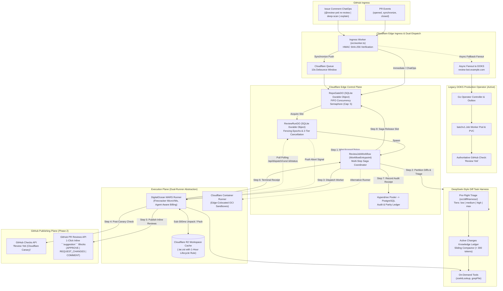

# Review Yeti: Cloudflare-Native Orchestration Engine

A serverless, Kubernetes-free orchestration engine for **Review Yeti**, built on **Cloudflare Workers**, **SQLite Durable Objects**, **Cloudflare Workflows**, **Cloudflare Queues**, and **Cloudflare Containers / Firecracker MicroVMs**.

> **Current Production Status**: **Live in Production Shadow Mode**  
> **Live Edge Endpoint**: [`https://review-yeti-cf-orchestrator.example.workers.dev`](https://review-yeti-cf-orchestrator.example.workers.dev)  
> **Production Parity Mode**: Active (`PARALLEL_MODE = "true"`). Legacy DOKS operator remains 100% active and authoritative (posting `"Review Yeti"`). Cloudflare operates concurrently in shadow validation mode (posting `"Review Yeti (Cloudflare Canary)"` and PR reviews with 1-click inline suggestions).

---

## Architecture Overview



---

## Why Migrate from DOKS to Cloudflare?

| Metric | DOKS Kubernetes Service | Cloudflare Edge + Containers | Advantage |
|---|---|---|---|
| **Base Idle Cost** | **$130 – $210 / month** (3–5 idle nodes, block storage PVCs, load balancers) | **$5 – $20 / month** (Workers Paid + active-CPU container billing) | **~85–90% cost reduction** (Zero idle cost) |
| **Operational Maintenance** | High: Node pool scaling, Kubernetes upgrades, CNI/Cilium updates, Helm/Flux drift, CRD migrations | Minimal: Managed serverless edge; no nodes, clusters, or volume mounts | **Cloudflare** |
| **Startup Latency** | Warm pod: ~1s; Cold node scale: 45s – 90s | Container start: ~2s – 4s; Edge webhook response: <50ms | **Cloudflare** |
| **Storage Reliability** | PVCs prone to stuck multi-zone volume attachments and orphan disk leaks | Cloudflare R2 streaming zstd cache (~500ms hydration) with auto-TTL | **Cloudflare** |

---

## Phase 2 Delivery: PR Review Experience & ChatOps

Phase 2 elevates Review Yeti from an advisory check-run into an interactive, 1-click GitHub Pull Request reviewer.

### 1. 1-Click Inline GitHub Suggestions (`reviewPublisher.ts`)
Findings with actionable code remedies are published directly into the PR diff using GitHub's native ````suggestion``` markdown block:

```markdown
🚨 **[P0]** **Missing Fencing Lease Epoch Check**

Worker does not validate `epoch === state.fencingEpoch`, allowing stale workers to overwrite active leases.

*Rule: `concurrency.fencing.lease_epoch_validation`*

```suggestion
if (epoch !== this.runState.fencingEpoch) {
  return { ok: false, reason: 'fencing_epoch_mismatch' };
}
```
```

#### Review Verdicts & State Transitions
- **`APPROVE`**: Diff is clean with zero P0/P1 issues and passes all policy invariants.
- **`REQUEST_CHANGES`**: One or more P0 (critical security/data integrity) or P1 (correctness bug) findings detected.
- **`COMMENT`**: Informational, architectural, or P2/P3 quality suggestions without blocking PR mergeability.

### 2. PR ChatOps Ingress Engine (`worker.ts`)
Developers can trigger, steer, and interrogate Review Yeti directly from GitHub PR comments:

| Command | Action | Thinking Effort |
|---|---|---|
| `@review-yeti re-review`<br/>*(or `/review-yeti review`)* | Triggers immediate review re-run without pushing new commits. Evicts any stale queued jobs. | Dynamic / Standard |
| `@review-yeti deep-scan`<br/>*(or `/review-yeti deep-scan`)* | Executes exhaustive architectural, security, and invariant review. | **`max`** (Upstream model thought budget) |
| `@review-yeti explain <file:line>`<br/>*e.g. `@review-yeti explain src/auth/token.ts:50`* | Delivers targeted architectural explanation and call-site breakdown for a specific line. | Dynamic |

---

## Adaptive Thinking Effort & Model-Delegated Reasoning Budgets

Rather than enforcing rigid artificial token budgets or client-side clamps, Review Yeti classifies changes during pre-flight triage (`src/diffHarness/diffTriage.ts`) and delegates the thought budget directly to the upstream model:

```
                      Pre-Flight AST & Risk Triage
                                   │
       ┌───────────────────────────┼───────────────────────────┐
       ▼                           ▼                           ▼
Simple / Batch             Module Clusters             Security / Critical
(`low`)                    (`medium` / `high`)         (`max`)
Doc fixes, typos,          Feature logic, paired       Auth, crypto, fencing,
lockfiles, trivial one-    unit tests, refactors       concurrency, secret handling
liners
       │                           │                           │
       ▼                           ▼                           ▼
Shallow CoT / Fast         Balanced CoT                Deep Exhaustive Reasoning
(Low inference latency)    (Standard depth)            (Full invariant proof)
```

- **`low`**: Prevents wasting 30 seconds of chain-of-thought spinning on trivial typo fixes or package bumps.
- **`medium` / `high`**: Standard balanced reasoning for features and refactors.
- **`max`**: In-depth invariant analysis for security, authorization, and concurrency primitives.
- Mapped natively to upstream engine parameters: `reasoning_effort` (OpenAI), thinking budgets (Anthropic), or provider flags (LiteLLM/Bifrost).

---

## Ephemeral R2 Workspace Cache Lifecycle (1-Hour Aggressive Expiry)

PR review iterations are bursty and transient: active review cycles happen within minutes of a developer pushing code. Storing full Git checkouts and Zoekt symbol indices for weeks causes massive R2 storage accumulation across abandoned branches.

Review Yeti employs a two-tier lifecycle model on `review-yeti-workspace-cache`:
- **`*/pr-*`**: **1-hour expiration rule**. Automatically purges transient PR caches after review completion.
- **`*/base-*` / `*/main`**: **24-hour retention**. Preserves warm base repositories for instant shallow delta clones.
- **Sub-300ms Hydration**: Streaming decompression (`tar -I "zstd -T0"`) provides instantaneous workspace setup when warm, with zero-risk fallback to shallow git clone when cold.

---

## Core Control Plane Primitives

### 1. `RepoGateDO` (SQLite Durable Object)
Manages per-repository concurrency limits (`MAX_CONCURRENT_JOBS = 5`):
- Single-threaded actor isolation backed by Cloudflare SQLite Durable Object storage.
- In-memory FIFO queue with persistence guarantees: when an active review completes or cancels, the next waiting run is automatically granted the concurrency slot.
- Exposes endpoints for active run lookup, queue eviction, and tombstone tracking.

### 2. `ReviewRunDO` (SQLite Durable Object)
The single-run coordinator replacing `PRReviewJob` CRDs and Kubernetes `coordinationv1.Lease`:
- **Atomic Fencing Epochs**: Epoch increments prevent stale workers or split-brain runners from submitting findings or holding locks.
- **Two-Tier In-Flight Cancellation**:
  - *Push Path*: When a PR is closed, converted to draft, or a newer commit arrives, `ReviewRunDO.requestCancellation()` transitions phase to `Cancelled` and signals container termination.
  - *Pull Path*: Exposes `/api/dispatch/runs/:runId/status`. Workers periodically poll `isCurrentHead === true`; if false, the worker's root `AbortController` fires, terminating upstream LLM inference streams instantly to save token costs.

### 3. `ReviewJobWorkflow` (Cloudflare Workflow)
A durable, multi-step execution pipeline extending `WorkflowEntrypoint`:
- **Step 1 (`mint-scoped-token`)**: Mints an ephemeral GitHub App token scoped exclusively to `checks:write` and `pull_requests:write`.
- **Step 2 (`acquire-fencing-lease`)**: Acquires the concurrency slot and registers fencing lease in `ReviewRunDO`.
- **Step 3 (`dispatch-container`)**: Dispatches the worker container via `ContainerRunner` interface.
- **Step 4 (`verify-and-record-receipt`)**: Validates terminal outcome receipt and writes audit record to PostgreSQL via Hyperdrive.
- **Step 5 (`cleanup-and-release`)**: Saga compensating step that guarantees token revocation and concurrency slot release.

---

## Directory Structure

```
packages/cf-orchestrator/
├── src/
│   ├── worker.ts                  # Webhook ingress, HMAC verification, 10s debounce, ChatOps & dual-dispatch
│   ├── repoGateDO.ts              # SQLite Durable Object: Concurrency semaphore (Cap: 5) & FIFO queue
│   ├── reviewRunDO.ts             # SQLite Durable Object: Fencing lease, heartbeats & 2-tier cancellation
│   ├── reviewJobWorkflow.ts       # Cloudflare Workflow: Multi-step durable coordinator extending WorkflowEntrypoint
│   ├── reviewPublisher.ts         # Phase 2: 1-click inline ```suggestion``` reviews (APPROVE/REQUEST_CHANGES/COMMENT)
│   ├── compareOrchestratorRuns.ts # Parity assertion logic, SHA-256 fingerprinting & CI ledger
│   ├── types.ts                   # Types and Cloudflare environment bindings
│   ├── diffHarness/               # DeepSeek-style diff task harness & context compactor
│   │   ├── diffTriage.ts          # Tiered triage (high-risk singular, medium cluster, lumped simple batch)
│   │   ├── activeChangesLedger.ts # Sliding context compactor (< 300 token knowledge ledger)
│   │   ├── diffTaskHarness.ts     # Concurrent task runner with on-demand Zoekt tools
│   │   └── index.ts               # Public exports
│   ├── tunnel/
│   │   ├── toolTunnelDefinition.ts # Declarative YAML parser with ${VAR_NAME} env interpolation
│   │   └── tunnelConfig.ts        # Multi-transport resolver (Direct, Cloudflare Tunnel, Tailscale)
│   └── runners/
│       ├── containerRunner.ts     # Container runner abstraction & Cloudflare Containers runner
│       ├── digitalOceanAgentRunner.ts # DO Managed Agents runner (Firecracker microVMs)
│       └── r2WorkspaceCache.ts    # Programmatic R2 .tar.zst cache hydration & verification
├── scripts/
│   ├── restore-r2-cache.sh        # Sub-300ms R2 cache unpack replacing K8s PVCs
│   └── stage-r2-cache.sh          # Stage .git & .zoekt index shards back to Cloudflare R2
├── test/                          # Comprehensive test suite: 893 tests across 211 suites (100% pass)
│   ├── e2e/                       # 74 Opaque-box E2E integration tests (Tiers 1–4)
│   ├── phase2_review_chatops.test.ts # Phase 2: 10 tests for suggestions, verdicts & ChatOps parsing
│   ├── diffTaskHarness.test.ts    # DeepSeek task harness, triage, and context compactor tests
│   ├── adversarial_control_plane.test.ts  # Tier 5: 40 Edge control plane stress tests
│   ├── adversarial_runners_parity.test.ts # Tier 5: 53 Runner & parity stress tests
│   └── adversarial_hardening.test.ts      # Tier 5: 22 Final hardening tests
└── wrangler.toml                  # Cloudflare DO, Workflow, Queue, R2, Hyperdrive, and Concurrency config
```

---

## Continuous Integration & Parity Testing

The orchestrator is fully integrated into GitHub Actions via `.github/workflows/review-yeti-cf-orchestrator-ci.yaml`:

- **Automatic Triggering**: Runs on every pull request and push touching `packages/cf-orchestrator/**` or `scripts/ci/**`.
- **Complete Verification Pipeline**:
  - Compiles TypeScript (`npm run build`).
  - Executes all 819 unit, contract, and adversarial tests (`npm test`).
  - Executes the 74-test E2E integration suite (`npm run test:e2e`).
  - Total: **893 tests across 211 suites (100% pass rate)**.
  - Verifies the CI parity CLI tool (`scripts/ci/compare-orchestrator-runs.js`).

---

## Operational Status: Non-Destructive Parallel Parity

> [!IMPORTANT]
> **DOKS Invariant**: The legacy Kubernetes operator deployment (`ct-review-yeti-operator`) is running and active in production. It continues to post the primary authoritative `"Review Yeti"` checks on GitHub pull requests. **Do not scale down DOKS, terminate node pools, or delete PVCs** during the ongoing shadow validation phase.

### Live Configuration Reference
```toml
# wrangler.toml
[vars]
ENVIRONMENT = "production"
PARALLEL_MODE = "true"
PARALLEL_CHECK_NAME = "Review Yeti (Cloudflare Canary)"
DOKS_FALLBACK_URL = "https://review-bot.example.com/api/webhooks/github"
MAX_CONCURRENT_JOBS = "5"
DEBOUNCE_WINDOW_SECONDS = "10"
PILOT_REPOSITORIES = "example-org/example-workspace,all"
```

### Future Production Cutover Runbook (Post-Parity Validation)
Once shadow parity is verified across 100+ consecutive real-world PR reviews:
1. Promote Check Name in `wrangler.toml`:
   ```toml
   PARALLEL_CHECK_NAME = "Review Yeti"
   DOKS_FALLBACK_URL = "" # Cease fanout
   ```
2. Redeploy Worker: `npm run deploy`
3. Scale Down DOKS:
   ```bash
   kubectl scale deployment ct-review-yeti-operator -n review-yeti --replicas=0
   kubectl delete pvc -l app=ct-review-yeti -n review-yeti
   ```
4. Reclaim dedicated DOKS node pool.

---

## Quick Commands

```bash
# Run unit & contract tests (819 tests across 197 suites)
npm test

# Run End-to-End integration suite (74 tests across 14 suites)
npm run test:e2e

# Build TypeScript
npm run build

# Deploy to Cloudflare Edge
npm run deploy

# Stream live edge logs
npx wrangler tail --format pretty
```
