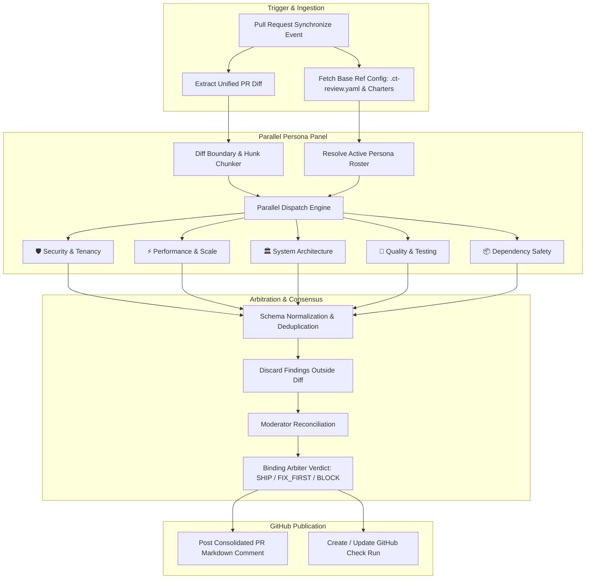
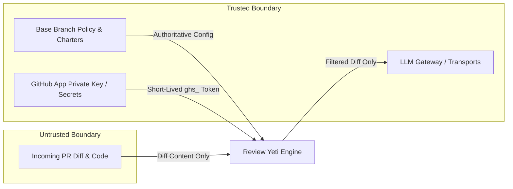
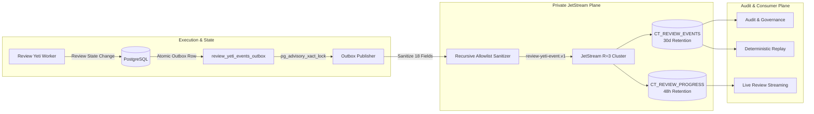

# 🏛️ Review Yeti System Architecture

This document details the architectural design, consensus engine, and execution models of **Review Yeti**.

---

## 🎯 Core Architectural Principles

Review Yeti is built around four foundational principles:

1. **Separation of Concerns (Persona Panels)**: Instead of asking a single prompt to review an entire pull request, Review Yeti dispatches specialized prompts to distinct personas (Security, Performance, Architecture, Testing, Dependencies).
2. **Deterministic Consensus & Arbitration**: Findings from all personas are collected, deduplicated, scored by severity (P0, P1, P2), and reconciled by an automated moderator and arbiter into a single binding verdict (`SHIP`, `FIX_FIRST`, `BLOCK`).
3. **Dual Execution Runtime**: Supports both lightweight, zero-infra **Ephemeral GitHub Actions** and high-scale **Kubernetes / DOKS Offloaded Workers** to eliminate billable CI runner wait time.
4. **Base-Ref Trust Boundary**: All review charters, configuration files, and security thresholds are read strictly from the pull request's **base branch** (e.g. `main`), preventing pull requests from tampering with their own review rules.

---

## 🔄 The Review Pipeline

---

## ⚙️ Execution Models

Review Yeti supports two distinct execution patterns:

### 1. Ephemeral In-Runner Mode (Action Mode)
- **Runtime**: Runs directly within the GitHub Actions virtual machine (`ubuntu-latest` or self-hosted runner).
- **Orchestration**: Managed via `action.yml` and `.github/workflows/pipelines/review-pipeline.js`.
- **Ideal For**: Quick adoption, public open-source repos, and teams with moderate PR volume.

### 2. Kubernetes Asynchronous Worker Mode (Operator / DOKS Mode)
- **Runtime**: Ephemeral containerized worker pods (`review-yeti-worker`) running inside a Kubernetes cluster (DOKS, EKS, GKE, etc.).
- **Orchestration**: 
  - GitHub Actions runs an ultra-fast dispatch shim (< 10 seconds).
  - Shim registers an in-progress Check Run (`review-status: DISPATCHED`, `gate-decision: PENDING`).
  - Admission service receives dispatch payload and spawns a `PRReviewJob` custom resource.
  - Review Yeti Operator schedules a lightweight worker pod (`node dist/cli/runLiveReview.js`).
  - Worker evaluates personas in parallel, completes the Check Run directly, and posts the consolidated review comment via a minted GitHub App installation token.
- **Ideal For**: High-velocity teams, monorepos, and organizations looking to eliminate billable CI runner minute waste.
- **Reference**: See [Kubernetes & DOKS Execution Mode](KUBERNETES_MODE.md).

---

## 🔒 Security & Trust Boundaries

### 1. Base-Ref Authority
A common vulnerability in CI-based review tools is that an attacker can submit a pull request modifying `.ct-review.yaml` or persona charters to disable all security checks and award itself an automatic approval.
Review Yeti eliminates this attack vector:
- All `.ct-review.yaml` policies and `.ct-review/personas/*.md` files are resolved exclusively from the target **base branch** (e.g., `origin/main`).
- Any configuration modifications contained within the PR diff are completely ignored during its own evaluation.

### 2. Diff Boundary Isolation
- Review Yeti transmits only the unified diff of changes—not your whole repository or git history.
- Any finding generated by an LLM that references a file path or line number not present in the modified hunks of the diff is discarded before publication.

### 3. Ephemeral GitHub App Credentials
- Review Yeti does not require permanent, broad personal access tokens (PATs).
- It signs an RS256 JWT using its private key and requests an ephemeral `ghs_` installation token from GitHub (valid for 60 minutes).
- Tokens are held in memory only and never written to logs or artifacts.

---

## ⚖️ Arbitration Engine & Merge Gate State Machine

Review Yeti standardizes findings into a clear severity hierarchy:

- **P0 (Critical Blocker)**: Direct security exploit, critical data loss hazard, credential leak, or total breaking change.
- **P1 (Important / Fix First)**: Functional bug, unhandled error condition, missing authorization check, or significant performance regression.
- **P2 (Nit / Suggestion)**: Code style inconsistency, readability improvement, minor refactor opportunity.

### Verdict Calculation Table

| Verdict | Condition | GitHub Check Run Conclusion | Merge Status |
| :--- | :--- | :--- | :--- |
| **`SHIP`** 🟢 | 0 P0s, 0 P1s, and P2 count below threshold | `conclusion: success` | ✅ Passing |
| **`FIX_FIRST`** 🟡 | 0 P0s, but 1+ P1s (or high volume of P2s) | `conclusion: neutral` or `failure` (configurable) | ⚠️ Attention Required |
| **`BLOCK`** 🔴 | 1+ P0s, or P1 count exceeding quorum threshold | `conclusion: failure` | 🚫 Blocked |

When integrated with GitHub Branch Protection, a `BLOCK` conclusion marks the required **Review Yeti** status check as failed, preventing accidental merges of hazardous code.

---

## 📈 Telemetry & Observability Plane

Review Yeti implements an enterprise-grade telemetry and observability plane across runner and Kubernetes deployments:

1. **Cumulative Prometheus Metrics (REL-817 / v1.60.2)**: All in-memory metric exporters enforce `AggregationTemporality.CUMULATIVE` (1), guaranteeing that counters (`ct_review_requests_total`, `ct_review_errors_total`, `ct_review_tokens_total`, `ct_review_model_cost_usd_total`, `ct_review_reaper_superseded_attempt_total`) increase monotonically without dropping to 0 between scrapes.
2. **Multi-Service Scrape Surface**:
   - `ct-review-action-dispatch` (`:3000/metrics`): Token volumes, USD model costs, and review durations.
   - `ct-review-job-dispatcher` (`:9090/metrics`): Queue depths and reaper recovery events.
   - `review-yeti-operator` (`:8080`): Controller loop and reconciliation telemetry.
3. **OpenTelemetry Collector Pipeline**: Accepts OTLP traces (`:4317`/`:4318`) and metrics in the `observability` namespace, routing traces to Grafana Tempo and converting metrics to Prometheus format on port `:8889`.
4. **VictoriaMetrics Integration**: Scrapes all cluster targets (20/20 active targets UP) for long-term retention and PromQL analytics.
5. **Alertmanager Rule Group (`review_yeti`)**: Evaluates 5 automated rules monitoring dispatch health, operator uptime, review execution latency, worker pod restarts, and error ratios.
6. **Grafana Operations Dashboard (`review-yeti-ops.json`)**: Pre-provisioned 12-panel dashboard (UID: `ct-review-yeti-ops`) with 23 PromQL queries covering throughput, latency quantiles, concurrency, cost accumulation, and reaper activity.
7. **Empirical Performance Benchmarks**: Qualified on live DOKS infrastructure (PR #271):
   - Fast-Ship Path: **13s** execution for doc-only diffs.
   - Full Modular DAG: **59s** execution across 5 persona lanes (23,043 tokens) with `SHIP` verdict.
   - Storage Profile: Ephemeral `emptyDir` 1Gi volumes with 0s PVC allocation delay.

---

## 🛰️ Private JetStream Event Plane & Transactional Outbox (API-3230 / ADR 0564)

Under ADR 0564 and API-3230, Review Yeti decouples lifecycle event distribution from raw database queries using a resilient event-driven architecture:

1. **Transactional Outbox Pattern**: State mutations (`QUEUED`, `DISPATCHED`, `COMPLETED`, `FAILED`, `SUPERSEDED`) write atomically to `review_yeti_events_outbox` in the same database transaction that updates review state, guarded by PostgreSQL advisory locks (`pg_advisory_xact_lock`).
2. **Strict Closed Envelope (`review-yeti-event.v1`)**: Closed schema containing exactly 15 top-level properties and monotonic Crockford Base32 ULIDs, bounded by a strict 16 KiB size ceiling.
3. **Recursive Allowlist Sanitizer**: Strips secrets, tokens, credentials, and full diff bodies across 18 sensitive fields before publishing.
4. **Dedicated Cluster Infrastructure**: Private R=3 JetStream cluster deployed across 3 Kubernetes worker nodes with anti-affinity, mTLS, Doppler NKey credentials, and zero-trust NetworkPolicies.
5. **No Raw Work Payload Streams**: The architecture explicitly prohibits untruncated `CT_REVIEW_WORK` payload streams, maintaining strict separation of concerns between control events and code data.

---

## 🔌 Extensibility & Configuration Passthrough

Review Yeti's configuration parser is designed for hierarchical extensibility:
- **Schema Passthrough**: Sub-schemas (`personaSchema`, `reviewsSchema`, `chatSchema`, `knowledgeBaseSchema`, etc.) support Zod `.passthrough()`, allowing organization policies (`policy/review-yeti.json` in `ct-review-actions`) and repository `.ct-review.yaml` files to pass custom keys.
- **Enterprise Controls**: First-class support for passing `skills`, `knowledge`, `metrics`, `telemetry`, `retry_analysis`, and raw `policy-json` overrides end-to-end from Action inputs to execution engines.

---

## 📚 Further Reading

- [GitHub App Setup Guide](GITHUB_APP_SETUP.md)
- [Kubernetes & DOKS Execution Mode](KUBERNETES_MODE.md)
- [DigitalOcean Kubernetes (DOKS) Operations](DOKS_REVIEW_OPERATIONS.md)
- [Friendly Onboarding Guide](ONBOARDING_GUIDE.md)
- [Configuration Reference](CONFIGURATION_REFERENCE.md)
