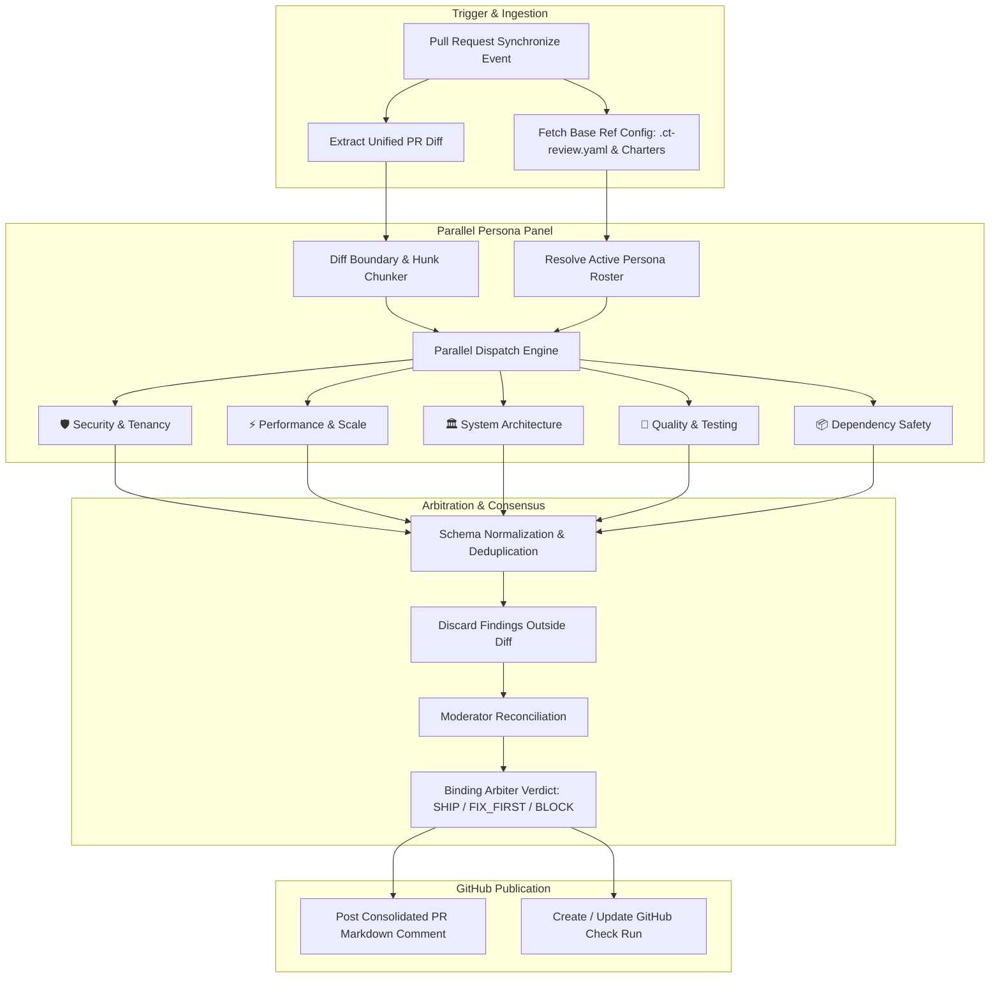
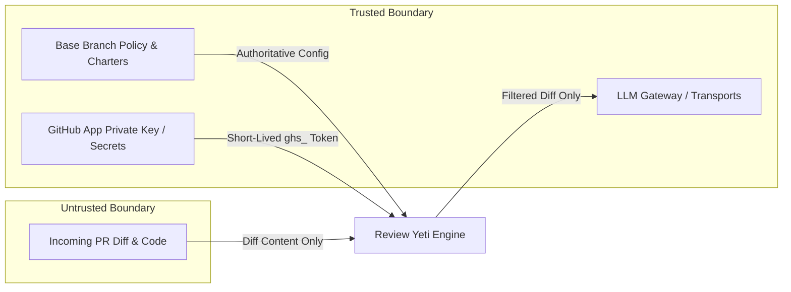

# 🏛️ Review Yeti System Architecture

This document details the architectural design, consensus engine, and execution models of **Review Yeti**.

---

## 🎯 Core Architectural Principles

Review Yeti is built around four foundational principles:

1. **Separation of Concerns (Persona Panels)**: Instead of asking a single prompt to review an entire pull request, Review Yeti dispatches specialized prompts to distinct personas (Security, Performance, Architecture, Testing, Dependencies).
2. **Deterministic Consensus & Arbitration**: Findings from all personas are collected, deduplicated, scored by severity (P0, P1, P2), and reconciled by an automated moderator and arbiter into a single binding verdict (`SHIP`, `FIX_FIRST`, `BLOCK`).
3. **Dual Execution Runtime**: Supports both lightweight, zero-infra **Ephemeral GitHub Actions** and high-scale **Kubernetes / DOKS Offloaded Workers** to eliminate billable CI runner wait time.
4. **Base-Ref Trust Boundary**: All review charters, configuration files, and security thresholds are read strictly from the pull request's **base branch** (e.g. `main`), preventing pull requests from tampering with their own review rules.

---

## 🔄 The Review Pipeline

---

## ⚙️ Execution Models

Review Yeti supports two distinct execution patterns:

### 1. Ephemeral In-Runner Mode (Action Mode)
- **Runtime**: Runs directly within the GitHub Actions virtual machine (`ubuntu-latest` or self-hosted runner).
- **Orchestration**: Managed via `action.yml` and `.github/workflows/pipelines/review-pipeline.js`.
- **Ideal For**: Quick adoption, public open-source repos, and teams with moderate PR volume.

### 2. Kubernetes Asynchronous Worker Mode (Operator / DOKS Mode)
- **Runtime**: Ephemeral containerized worker pods (`review-yeti-worker`) running inside a Kubernetes cluster (DOKS, EKS, GKE, etc.).
- **Orchestration**: 
  - GitHub Actions runs an ultra-fast dispatch shim (< 10 seconds).
  - Shim registers an in-progress Check Run (`review-status: DISPATCHED`, `gate-decision: PENDING`).
  - Admission service receives dispatch payload and spawns a `PRReviewJob` custom resource.
  - Review Yeti Operator schedules a lightweight worker pod (`node dist/cli/runLiveReview.js`).
  - Worker evaluates personas in parallel, completes the Check Run directly, and posts the consolidated review comment via a minted GitHub App installation token.
- **Ideal For**: High-velocity teams, monorepos, and organizations looking to eliminate billable CI runner minute waste.
- **Reference**: See [Kubernetes & DOKS Execution Mode](KUBERNETES_MODE.md).

---

## 🔒 Security & Trust Boundaries

### 1. Base-Ref Authority
A common vulnerability in CI-based review tools is that an attacker can submit a pull request modifying `.ct-review.yaml` or persona charters to disable all security checks and award itself an automatic approval.
Review Yeti eliminates this attack vector:
- All `.ct-review.yaml` policies and `.ct-review/personas/*.md` files are resolved exclusively from the target **base branch** (e.g., `origin/main`).
- Any configuration modifications contained within the PR diff are completely ignored during its own evaluation.

### 2. Diff Boundary Isolation
- Review Yeti transmits only the unified diff of changes—not your whole repository or git history.
- Any finding generated by an LLM that references a file path or line number not present in the modified hunks of the diff is discarded before publication.

### 3. Ephemeral GitHub App Credentials
- Review Yeti does not require permanent, broad personal access tokens (PATs).
- It signs an RS256 JWT using its private key and requests an ephemeral `ghs_` installation token from GitHub (valid for 60 minutes).
- Tokens are held in memory only and never written to logs or artifacts.

---

## ⚖️ Arbitration Engine & Merge Gate State Machine

Review Yeti standardizes findings into a clear severity hierarchy:

- **P0 (Critical Blocker)**: Direct security exploit, critical data loss hazard, credential leak, or total breaking change.
- **P1 (Important / Fix First)**: Functional bug, unhandled error condition, missing authorization check, or significant performance regression.
- **P2 (Nit / Suggestion)**: Code style inconsistency, readability improvement, minor refactor opportunity.

### Verdict Calculation Table

| Verdict | Condition | GitHub Check Run Conclusion | Merge Status |
| :--- | :--- | :--- | :--- |
| **`SHIP`** 🟢 | 0 P0s, 0 P1s, and P2 count below threshold | `conclusion: success` | ✅ Passing |
| **`FIX_FIRST`** 🟡 | 0 P0s, but 1+ P1s (or high volume of P2s) | `conclusion: neutral` or `failure` (configurable) | ⚠️ Attention Required |
| **`BLOCK`** 🔴 | 1+ P0s, or P1 count exceeding quorum threshold | `conclusion: failure` | 🚫 Blocked |

When integrated with GitHub Branch Protection, a `BLOCK` conclusion marks the required **Review Yeti** status check as failed, preventing accidental merges of hazardous code.

---

## 📚 Further Reading

- [GitHub App Setup Guide](GITHUB_APP_SETUP.md)
- [Kubernetes & DOKS Execution Mode](KUBERNETES_MODE.md)
- [Friendly Onboarding Guide](ONBOARDING_GUIDE.md)
- [Configuration Reference](CONFIGURATION_REFERENCE.md)
