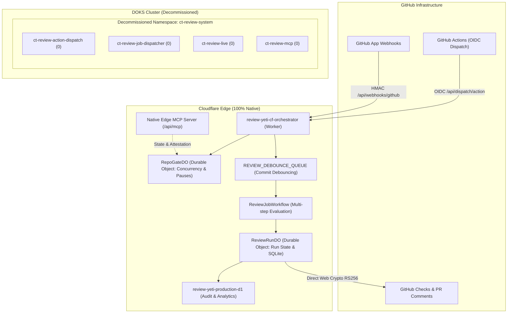

# Cloudflare-Native Review Yeti Operator Migration Plan

## 1. Executive Summary & Objective

Following the successful cutover of the primary review runner to Cloudflare Edge (`review-yeti-cf-orchestrator`), 100 consecutive matches in shadow parity, and the formal decommissioning of the DOKS worker operator via ADR 0822, this plan defines the path to build a **100% Cloudflare-Native Operator** directly within Review Yeti.

Completing this migration will eliminate the remaining four deployments in the `ct-review-system` namespace on DOKS Kubernetes (`ct-review-action-dispatch`, `ct-review-job-dispatcher`, `ct-review-live`, `ct-review-mcp`), reclaiming **3,328 MiB of memory** and **775m CPU** on the cluster and achieving zero operational dependence on DOKS for PR review orchestration and gating.

---

## 2. Architecture Comparison

### Current Hybrid Architecture (Post-ADR 0822)
* **Compute Plane**: Cloudflare Edge Worker (`review-yeti-cf-orchestrator`) running authoritatively as `"Review Yeti"`.
* **DOKS Fallback Operator**: Scaled to 0 replicas.
* **Remaining DOKS Dependencies**:
  * `ct-review-action-dispatch` (2 replicas): GitHub Actions OIDC admission (`/api/dispatch/action`), repository allowlist enforcement, PostgreSQL admission state.
  * `ct-review-job-dispatcher` (2 replicas): Legacy Kubernetes job dispatching logic.
  * `ct-review-live` (1 replica): Server-Sent Events (SSE) stream for live review updates.
  * `ct-review-mcp` (1 replica): Internal MCP server exposing mutating review tools (`attest_pr_gate`, `trigger_review`, `dispute_finding`).
  * `review-yeti-control-plane-quota`: 3,328 MiB memory limit / 2,560 MiB steady usage.

### Target Cloudflare-Native Architecture (100% Serverless)
* **Ingress & OIDC Dispatch**: Native Cloudflare Worker endpoint (`/api/dispatch/action`) verifying GitHub Actions OIDC tokens using Web Crypto against GitHub's public JWKS.
* **Authoritative Publisher**: Edge Worker signs GitHub App JWTs using Web Crypto RS256 with secrets in Cloudflare Secret storage, caching installation tokens in Cloudflare KV (`AUTH_CACHE`).
* **Concurrency & Gatekeeper**: Cloudflare Durable Objects (`RepoGateDO` and `ReviewRunDO`) manage repo-level serialization, branch protection gates, run lifecycle, and dynamic operator passthrough toggles with zero database round-trips.
* **Asynchronous Workflow Engine**: Cloudflare Workflows (`ReviewJobWorkflow`) executes multi-step persona evaluation, consensus aggregation, and finding deduplication.
* **Debouncing & Buffering**: Cloudflare Queues (`review-yeti-debounce`) handles commit trailing quiet windows (60s).
* **Audit & Long-Term State**: Cloudflare D1 (`review-yeti-production-d1`) for relational SQL storage and queryable historical receipts.
* **Unified MCP Server**: Native Edge MCP endpoint (`/api/mcp` and `/mcp`) serving both read-only observability tools and mutating gate attestation tools.

---

## 3. Core Architectural Modules

### Module 1: Edge GitHub Actions OIDC Dispatch
* **Path**: `POST /api/dispatch/action` in `cf-orchestrator`.
* **Security & Auth**:
  * Extracts Bearer token from `Authorization` header.
  * Validates token using `jose` with Web Crypto against `https://token.actions.githubusercontent.com/.well-known/jwks`.
  * Verifies issuer (`https://token.actions.githubusercontent.com`), audience (`review-yeti-doks-dispatch` or `review-yeti-edge-dispatch`), token age (`<10m`), and algorithms (`RS256`).
  * Enforces that token claims (`repository`, `repository_id`, `sha`, `ref`) match the dispatch request payload.
* **Receipt**: Emits canonical `ActionDispatchReceipt.v1` or `ActionDispatchPassthrough.v1`.

### Module 2: Edge Authoritative GitHub App Publisher
* **Security**:
  * Private key stored securely in Cloudflare Secrets (`GITHUB_APP_PRIVATE_KEY`).
  * Generates GitHub App JWT (RS256) locally via Web Crypto API.
  * Requests installation tokens from GitHub API and caches them in Cloudflare KV (`AUTH_CACHE`) with a 50-minute TTL.
* **Publishing**:
  * Creates and updates GitHub Checks (`Review Yeti` and `Review Yeti Gate`).
  * Posts and updates the sticky markdown summary comment on pull requests.

### Module 3: Concurrency, Gatekeeping & Dynamic Passthrough in Durable Objects
* **`RepoGateDO`**:
  * Tracks active runs and pending queue per repository.
  * Provides an instant admin endpoint or KV flag to toggle `operator_global_passthrough` without cluster redeployment.
* **`ReviewRunDO`**:
  * Tracks granular state for each run (`queued`, `reviewing`, `aggregating`, `publishing`, `completed`).
  * Persists review findings, persona responses, and attestation receipts.

### Module 4: Unified Edge MCP Server
* Extends `cf-orchestrator/src/mcp/mcpRouter.ts` with mutating tools previously exclusive to DOKS:
  * `review_yeti_attest_pr_gate`: Attests merge-group readiness directly into `RepoGateDO`.
  * `review_yeti_trigger_review`: Triggers on-demand evaluation runs via `ReviewJobWorkflow`.
  * `review_yeti_dispute_finding`: Records finding dispute adjustments.
* Serves Streamable HTTP and SSE transports over `https://review-bot.example.com/mcp`.

---

## 4. Phased Implementation Roadmap

### Phase 1: Edge OIDC Action Dispatch (Current)
* Add `/api/dispatch/action` route to `cf-orchestrator`.
* Implement `verifyGitHubActionsOidc` using `jose` and GitHub's JWKS.
* Implement dispatch request schema validation and payload-to-claims assertion.
* Wire up immediate dispatch to `ReviewJobWorkflow` and `RepoGateDO`.
* Unit and integration test coverage verifying valid claims, forged tokens, mismatched repositories, and receipt structures.

### Phase 2: Authoritative Edge App Publisher
* Implement Web Crypto RS256 GitHub App authentication and token caching in `cf-orchestrator/src/github/`.
* Implement Check Run and sticky comment publishing in `ReviewRunDO`.
* Verify exact visual and functional parity with existing DOKS checks.

### Phase 3: Unified Edge MCP Server
* Port mutating review tools (`attest_pr_gate`, `trigger_review`, `dispute_finding`) into `cf-orchestrator/src/mcp/tools/`.
* Validate conformance with Model Context Protocol specification.
* Update `mcp_config.json` and Bifrost routing in configuration to route MCP traffic to Cloudflare.

### Phase 4: DNS & Ingress Cutover
* Update default dispatch URL in `review-yeti-bot/action.yml` to `https://review-bot.example.com`.
* Update GitHub App webhook URL to `https://review-bot.example.com/api/webhooks/github`.
* Observe 100% production traffic running directly on Cloudflare Edge.

### Phase 5: DOKS Decommission & Cluster Quota Reclamation
* Remove `clusters/doks-nyc1/apps/ct-review-system/` from Flux in deployment infrastructure.
* Land ADR documenting the 100% Cloudflare-Native architecture.
* Delete the `ct-review-system` namespace on DOKS.
* Reclaim 3,328 MiB of RAM and 775m CPU for remaining essential workloads.

---

## 5. Constraints & Compliance
* **Zero GCP Resources**: 100% deployed on Cloudflare Workers, Durable Objects, D1, R2, and KV.
* **Security**: Strict constant-time cryptographic verification for HMAC and JWT signatures.
* **Reliability**: Single-flight execution and bounded debouncing to prevent runner storms.
