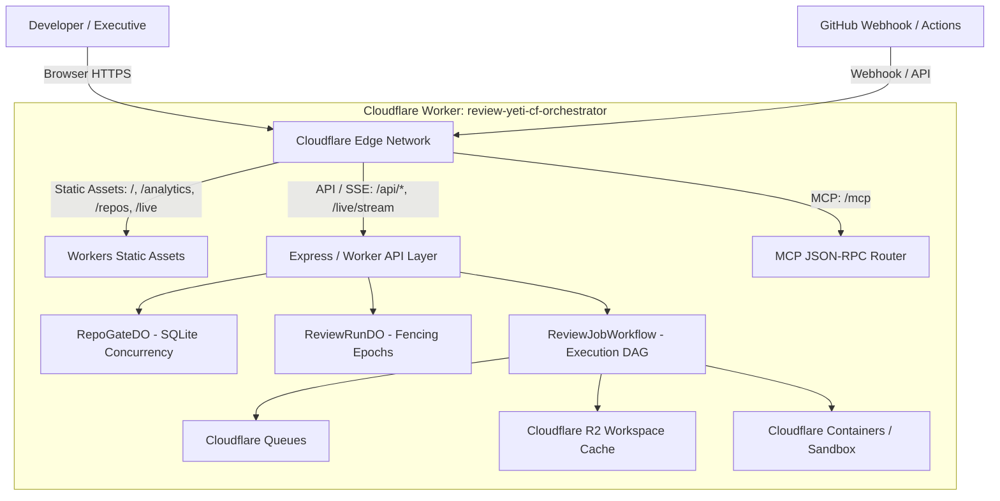

# ☁️ Deploying the Review Yeti Portal & Dashboard to Cloudflare

Review Yeti features an interactive management portal and analytics dashboard (benchmarked against CodeRabbit and Greptile). The portal includes **Live Review Inspector** streaming reasoning feeds (`/live`), **Executive & Engineering Analytics** (`/analytics`), **Repository & Review Rules Management** (`/repos`), and **Human-in-the-Loop Verdict Controls**.

Because the Review Yeti **control plane** (Durable Objects, Workflows, Queues, R2) and **execution plane** (Cloudflare Containers / microVM sandboxes) already run on Cloudflare Workers (`review-yeti-cf-orchestrator`), the dashboard portal is designed to deploy **directly on Cloudflare Workers as a unified serverless application** using **Workers Static Assets** or **Cloudflare Pages**.

---

## 📍 Where Is My Dashboard? (Dashboard URLs)

Your Review Yeti dashboard is available at the following endpoints:

| Environment | Access URL | Architecture |
| :--- | :--- | :--- |
| ⚡ **Live Cloudflare Edge Worker** | [**`https://review-yeti-cf-orchestrator.example.workers.dev`**](https://review-yeti-cf-orchestrator.example.workers.dev) | Serverless edge deployment (Workers + Durable Objects + Assets) |
| 🌐 **Production Domain (Cloudflare DNS)** | [**`https://review-bot.example.com`**](https://review-bot.example.com) | Custom domain routed directly via Cloudflare DNS / Routes |
| 💻 **Local Development** | [**`http://localhost:3000`**](http://localhost:3000) | Local development workstation (`npm start` or `npm run dev`) |

### Primary Dashboard Views
- **Executive & Engineering Analytics**: [`https://review-yeti-cf-orchestrator.example.workers.dev/analytics`](https://review-yeti-cf-orchestrator.example.workers.dev/analytics)  
  *Nearest-rank p95 turnaround latencies, token burn curves, model cost per PR/repo, and finding severity ratios.*
- **Live Review Inspector**: [`https://review-yeti-cf-orchestrator.example.workers.dev/live`](https://review-yeti-cf-orchestrator.example.workers.dev/live)  
  *Real-time SSE persona reasoning tokens (`reasoning:chunk`), tool execution traces, and interactive diff viewer.*
- **Repositories & Review Rules**: [`https://review-yeti-cf-orchestrator.example.workers.dev/repos`](https://review-yeti-cf-orchestrator.example.workers.dev/repos)  
  *Organization discovery, active PR inspection, on-demand review dispatch, and per-repo review rules CRUD.*
- **Platform & GitHub App Settings**: [`https://review-yeti-cf-orchestrator.example.workers.dev/settings`](https://review-yeti-cf-orchestrator.example.workers.dev/settings)  
  *GitHub App credentials, AI provider model configurations, and platform-wide defaults.*

---

## 🏗️ Cloudflare-Native Architecture

Review Yeti eliminates origin server bottlenecks by unifying the control plane, execution plane, and dashboard portal onto Cloudflare's serverless edge:



1. **Frontend Portal (Next.js 14 Static Export)**:
   - Configured with `output: 'export'` in `next.config.js`.
   - Pre-renders all 13 routes (`index.html`, `analytics.html`, `live.html`, `repos.html`, `settings.html`, etc.) into `out/`.
   - Served at zero-latency from Cloudflare Edge via **Workers Static Assets** (`[assets]`).
2. **Backend Control Plane (`review-yeti-cf-orchestrator`)**:
   - **`RepoGateDO`**: Per-repository FIFO concurrency gates and commit debounce management.
   - **`ReviewRunDO`**: PR review run coordinator with SQLite persistence and atomic cancellations.
   - **`ReviewJobWorkflow`**: Multi-persona review DAG execution.
   - **`WORKSPACE_CACHE_BUCKET`**: Cloudflare R2 diff and Zoekt symbol cache.
   - **`REVIEW_DEBOUNCE_QUEUE`**: Cloudflare Queues for commit burst handling.
3. **Execution Plane**:
   - Cloudflare Containers / sandboxes executing multi-persona AI evaluations.

---

## 🚀 Deployment Pattern 1: Unified Cloudflare Worker with Static Assets (Recommended)

This is the standard, unified deployment where the Cloudflare Worker serves both the backend control plane APIs and the frontend dashboard portal.

### Step 1: Build the Static Frontend Export

From the repository root:

```bash
# Build the Next.js static HTML/JS/CSS assets
npm run build:frontend
```

This compiles the static export into the **`out/`** directory.

---

### Step 2: Configure `wrangler.toml` with Static Assets

In your `wrangler.toml` (e.g. `cf-orchestrator/wrangler.toml`), add the `[assets]` binding pointing to your compiled `out/` directory:

```toml
name = "review-yeti-cf-orchestrator"
main = "src/worker.ts"
compatibility_date = "2026-09-01"
compatibility_flags = ["nodejs_compat"]

# 🎨 Serve the Next.js Portal directly from Cloudflare Edge
[assets]
directory = "../out"
binding = "ASSETS"
not_found_handling = "single-page-application"

# Durable Object bindings
[durable_objects]
bindings = [
  { name = "REPO_GATE", class_name = "RepoGateDO" },
  { name = "REVIEW_RUN", class_name = "ReviewRunDO" }
]

# Cloudflare Workflows binding
[[workflows]]
name = "review-job-workflow"
binding = "REVIEW_JOB_WORKFLOW"
class_name = "ReviewJobWorkflow"

# Cloudflare Queues for commit debouncing
[[queues.producers]]
binding = "REVIEW_DEBOUNCE_QUEUE"
queue = "review-yeti-debounce"

# Cloudflare R2 Workspace Cache
[[r2_buckets]]
binding = "WORKSPACE_CACHE_BUCKET"
bucket_name = "review-yeti-workspace-cache"

# Environment Variables
[vars]
ENVIRONMENT = "production"
DASHBOARD_URL = "https://review-bot.example.com"
RUNNER_TYPE = "cloudflare"
```

---

### Step 3: Worker Ingress Fallback to Static Assets

In `src/worker.ts`, ensure unmatched web routes fall back to serving static assets via `env.ASSETS`:

```typescript
// src/worker.ts
export default {
  async fetch(request: Request, env: Env, ctx: ExecutionContext): Promise<Response> {
    const url = new URL(request.url);

    // 1. Webhook and API Ingress
    if (url.pathname.startsWith('/api/') || url.pathname.startsWith('/mcp')) {
      return handleApiRequest(request, env, ctx);
    }

    // 2. Health & Readiness checks
    if (url.pathname === '/health' || url.pathname === '/ready') {
      return Response.json({ status: 'ok', service: 'review-yeti-cf-orchestrator' });
    }

    // 3. Fallback to Static Portal Assets (Next.js Dashboard)
    if (env.ASSETS) {
      return env.ASSETS.fetch(request);
    }

    return new Response('Not Found', { status: 404 });
  }
};
```

---

### Step 4: Deploy with Wrangler

```bash
cd cf-orchestrator
npx wrangler deploy
```

Your unified Cloudflare Worker will deploy both the API control plane and the frontend portal:
```text
Uploaded review-yeti-cf-orchestrator (1.85 sec)
Published review-yeti-cf-orchestrator (0.42 sec)
  https://review-yeti-cf-orchestrator.example.workers.dev
```

---

## ⚡ Deployment Pattern 2: Cloudflare Pages (Standalone Frontend)

If you prefer keeping the frontend portal deployment decoupled in Cloudflare Pages:

1. **Build Frontend**:
   ```bash
   npm run build:frontend
   ```
2. **Deploy to Pages**:
   ```bash
   npx wrangler pages deploy out --project-name review-yeti-portal
   ```
3. **Route API Traffic to Worker**:
   Add `functions/api/[[path]].ts` in your Pages project to proxy `/api/*` to `https://review-yeti-cf-orchestrator.example.workers.dev`.

---

## 🔒 Deployment Pattern 3: Cloudflare Tunnel (`cloudflared`) to DOKS / Local Server

For hybrid setups or local testing while running alongside the DOKS Kubernetes operator:

1. **Install and run `cloudflared`**:
   ```bash
   brew install cloudflare/cloudflare/cloudflared
   npx cloudflared tunnel --url http://localhost:3000
   ```
2. **Route your custom domain** via `~/.cloudflared/config.yml` pointing to your local or Kubernetes service `http://ct-review-bot:3000`.

---

## ⚙️ Cloudflare SSE Streaming Configuration (Live Review Inspector)

The **Live Review Inspector** (`/live`) uses HTTP Server-Sent Events (SSE) on `/api/live/stream/:jobId` to stream persona reasoning tokens and tool execution traces in real time.

By default, Cloudflare proxies can buffer HTTP responses. To ensure zero-latency token streaming:

1. In the Cloudflare Dashboard, go to your domain > **Caching** > **Cache Rules**.
2. Click **Create rule**.
3. **Rule name**: `Review Yeti SSE Streaming Bypass`.
4. **When incoming requests match**:
   - `URI Path` `starts with` `/api/live/stream/`
5. **Cache eligibility**: **Bypass cache**.
6. Under **Additional response caching settings**, select **Response Buffering: Disabled**.
7. Click **Deploy**.

---

## 🔐 GitHub OAuth Configuration for Cloudflare

To enable GitHub OAuth login across your Cloudflare portal:

1. Go to [GitHub Developer Settings > OAuth Apps](https://github.com/settings/developers).
2. Configure your application:
   - **Homepage URL**: `https://review-bot.example.com` (or `https://review-yeti-cf-orchestrator.example.workers.dev`)
   - **Authorization callback URL**: `https://review-bot.example.com/api/auth/github/callback`
3. Store `GITHUB_CLIENT_ID` and `GITHUB_CLIENT_SECRET` via Wrangler secrets:
   ```bash
   npx wrangler secret put GITHUB_CLIENT_ID
   npx wrangler secret put GITHUB_CLIENT_SECRET
   ```

---

## ✅ Cloudflare Edge Verification Checklist

Verify your Cloudflare deployment with the following quick checks:

```bash
# 1. Verify health check on Cloudflare Worker
curl -I https://review-yeti-cf-orchestrator.example.workers.dev/health
# Expected: HTTP/2 200 OK

# 2. Verify static frontend returns HTML
curl -I https://review-yeti-cf-orchestrator.example.workers.dev/
# Expected: HTTP/2 200 OK, Content-Type: text/html

# 3. Verify Analytics route
curl -I https://review-yeti-cf-orchestrator.example.workers.dev/analytics
# Expected: HTTP/2 200 OK

# 4. Verify SSE live streaming endpoint
curl -N -H "Accept: text/event-stream" https://review-yeti-cf-orchestrator.example.workers.dev/api/live/stream/test
# Expected: Content-Type: text/event-stream
```

---

## 📚 Related Documentation
- 🚀 **[Onboarding Guide](ONBOARDING_GUIDE.md)** — Setting up GitHub App integration and rules.
- 📖 **[User Guide](USER_GUIDE.md)** — Operational walkthrough of all dashboard features.
- ☸️ **[Kubernetes Mode Guide](KUBERNETES_MODE.md)** — DOKS operator and cluster architecture.
- 🛠️ **[Troubleshooting Guide](TROUBLESHOOTING.md)** — Diagnosing networking and streaming issues.
