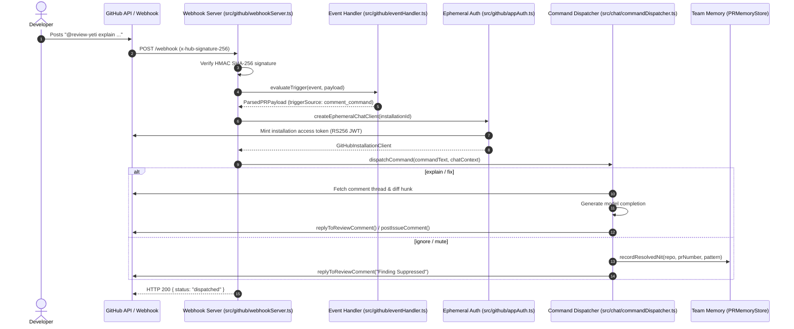

# 💬 Review Yeti — Interactive PR Chat & Mentoring Guide

Review Yeti includes an interactive PR mentoring assistant that allows engineers to collaborate directly with the AI review panel within GitHub Pull Request comments and review threads. By mentioning `@review-yeti` (or `@ct-review`), developers can request deep architectural explanations, ask for 1-click code fixes, or record persistent nit suppression rules in team memory.

---

## 📋 Table of Contents

1. [Overview & Bot Mentions](#overview--bot-mentions)
2. [Command Suite](#command-suite)
   - [`@review-yeti explain`](#review-yeti-explain)
   - [`@review-yeti fix` & `@review-yeti refactor`](#review-yeti-fix--review-yeti-refactor)
   - [`@review-yeti ignore` & `@review-yeti mute`](#review-yeti-ignore--review-yeti-mute)
   - [`@review-yeti summarize`](#review-yeti-summarize)
   - [`@review-yeti review`](#review-yeti-review)
3. [Webhook Event Routing Architecture](#webhook-event-routing-architecture)
4. [Ephemeral GitHub App Token Authentication](#ephemeral-github-app-token-authentication)
5. [In-Thread Context & Diff Resolution](#in-thread-context--diff-resolution)
6. [Persistent Nit Suppression in Team Memory](#persistent-nit-suppression-in-team-memory)
7. [Non-Bypassable Security Safety Policy](#non-bypassable-security-safety-policy)
8. [End-to-End Examples](#end-to-end-examples)
9. [Troubleshooting](#troubleshooting)

---

## 🤖 Overview & Bot Mentions

Review Yeti listens for interactive mentions in pull request conversations. You can invoke the bot in two places:

1. **Inline Review Comments**: Replying directly to a specific finding posted by Review Yeti or another reviewer. In this context, Review Yeti automatically resolves the file path, line numbers, and diff hunk under discussion.
2. **Top-Level PR Comments**: Posting a general comment on the main pull request timeline. In this context, Review Yeti analyzes the entire pull request diff and metadata.

### Supported Bot Mention Handles

The command parser recognizes the following case-insensitive handles:
- `@review-yeti` (standard primary handle)
- `@review-yeti-bot` / `@review-yeti[bot]`
- `@ct-review` (supported compatibility alias)
- `@ct-review-bot` / `@ct-review[bot]`
- `@bot`

```markdown
@review-yeti explain why parameterization is required here
```

---

## ⚡ Command Suite

### `@review-yeti explain`

Provides architectural context, security reasoning, and root-cause analysis for a specific finding or code change.

- **Syntax**: `@review-yeti explain [optional question or focus area]`
- **Context Used**: The comment thread history, the file diff hunk, and PR metadata.
- **Output**: A structured markdown explanation detailing the underlying design principles, potential security hazards, or edge-case failures.

#### Example:
```markdown
@review-yeti explain why string interpolation in this SQL query is dangerous
```

**Bot Response**:
> ### Code Explanation
> 
> ### Architectural & Security Rationale
> In `src/db/users.ts:42`, the SQL query is constructed using string interpolation:
> ```typescript
> const query = `SELECT * FROM users WHERE email = '${email}'`;
> ```
> While input validation may exist at the controller boundary, string interpolation violates the principle of defense-in-depth. If malicious input containing quote primitives (`' OR '1'='1`) reaches this layer, it alters the Abstract Syntax Tree (AST) of the database execution engine.
> 
> Using parameterized queries separates query logic from data input, allowing the database driver to treat user parameters strictly as values rather than executable syntax.

---

### `@review-yeti fix` & `@review-yeti refactor`

Generates an actionable, copy-pasteable replacement or native GitHub 1-click commit suggestion.

- **Syntax**: `@review-yeti fix [specific instructions]`
- **Alias**: `@review-yeti refactor [specific instructions]`
- **Output**: Generates a native GitHub ` ```suggestion ` block whenever line bounds allow, allowing engineers to click **Commit suggestion** directly in GitHub's web interface.

#### Example:
```markdown
@review-yeti fix use parameterized query with pg pool
```

**Bot Response**:
> ### Code Fix Suggestion
> 
> Here is a clean code fix suggestion using parameter substitution:
> 
> ```suggestion
> const result = await pool.query('SELECT * FROM users WHERE email = $1', [email]);
> ```

---

### `@review-yeti ignore` & `@review-yeti mute`

Dismisses a finding as an intentional pattern or false-positive nit, permanently recording the suppression rule in repository team memory.

- **Syntax**:
  - `@review-yeti ignore [pattern] [- reason]`
  - `@review-yeti mute [rule:<rule-id>] [- reason]`
- **Automatic Fallback**: If no pattern is explicitly provided, Review Yeti automatically extracts the finding's title and file path from the parent review comment thread.
- **Persistence**: Saved to the repository's SQLite WAL database at `.ct-memory/team_memory.db`.
- **Future Runs**: Subsequent review passes automatically suppress matching nits, eliminating review fatigue.

#### Examples:
```markdown
# Explicit pattern and reason
@review-yeti ignore Trailing comma - Optional in configuration files

# Rule-based mute
@review-yeti mute rule:no-explicit-any - Legacy migration file

# Context-inferred ignore (replying directly to a finding comment)
@review-yeti ignore
```

**Bot Response**:
> ### Finding Suppressed
> 
> Recorded nit suppression rule in persistent team memory:
> - **Pattern**: `Trailing comma`
> - **File Path**: `src/config/theme.ts`
> - **Reason**: Optional in configuration files
> 
> Future reviews on this repository will automatically suppress this finding.

---

### `@review-yeti summarize`

Regenerates a high-level architectural walkthrough, module change summary, and Mermaid diagram for the pull request.

- **Syntax**: `@review-yeti summarize`
- **Output**: Analyzes all changed files across the PR and posts an updated summary comment containing an architectural Mermaid flowchart or sequence diagram.

---

### `@review-yeti review`

Triggers an immediate on-demand re-evaluation of the PR by convening the full parallel persona panel.

- **Syntax**: `@review-yeti review`
- **Use Case**: Useful after pushing incremental fixups or when re-evaluating external checks.

---

## 🏗️ Webhook Event Routing Architecture

Review Yeti routes interactive chat commands through its webhook pipeline:



### Event Ingestion Points

Review Yeti ingests webhooks at:
- `POST /webhook`
- `POST /api/webhook/github`
- `POST /api/webhooks/github`

Incoming events must match:
- `x-github-event: issue_comment` (with `action: created`)
- `x-github-event: pull_request_review_comment` (with `action: created`)

Bot self-events (e.g. from `review-yeti[bot]`) are dropped immediately to prevent infinite reply loops.

---

## 🔐 Ephemeral GitHub App Token Authentication

Review Yeti enforces strict least-privilege access using **ephemeral GitHub App installation tokens**:

1. **Zero Long-Lived Tokens**: No personal access tokens (PATs) are stored in the server runtime.
2. **Cryptographic RS256 JWT**: The webhook server signs a JSON Web Token with the GitHub App Private Key:
   - `iss`: GitHub App ID
   - `iat`: Timestamp issued (with 60-second clock-skew allowance)
   - `exp`: 10-minute expiry (`iat + 600s`)
   - `alg`: RS256
3. **Short-Lived Installation Token**: Review Yeti calls `POST https://api.github.com/app-installations/{installation_id}/access_tokens` using the JWT to mint a temporary scoped token (`ghs_...`).
4. **Immediate Disposal**: The ephemeral client executes the requested command and releases the token from memory.

---

## 🧵 In-Thread Context & Diff Resolution

When replying to an inline review comment, Review Yeti resolves context through a hierarchy:

1. **Thread History**: Queries `GET /repos/{owner}/{repo}/pulls/{pr_number}/comments/{comment_id}` to retrieve all prior back-and-forth replies in the thread.
2. **Diff Hunk Extraction**: Reads the associated `diff_hunk` recorded on the root review comment.
3. **File Changes Fallback**: If the root comment lacks an explicit hunk, Review Yeti queries `GET /repos/{owner}/{repo}/pulls/{pr_number}/files` and extracts the relevant file patch up to 4,000 characters.
4. **Targeted Thread Reply**: Calls `POST /repos/{owner}/{repo}/pulls/{pr_number}/comments/{comment_id}/replies` so that the answer stays threaded directly under the specific code line.

---

## 🧠 Persistent Nit Suppression in Team Memory

When an engineer dismisses a finding using `@review-yeti ignore` or `@review-yeti mute`, the suppression is recorded in the repository's SQLite database (`.ct-memory/team_memory.db`):

```sql
INSERT INTO resolved_nits (
  id, repo, pr_number, pattern, file_path, reason, rule_id, resolved_at
) VALUES (
  'nit_...', 'org/repo', 42, 'Trailing comma', 'src/config/**', 'Optional in config', 'rule_style', '2026-09-04T...'
);
```

### Matching Algorithm
On subsequent PR evaluations, `NitSuppressionEngine` filters findings using a multi-phase matching strategy:
1. **File Path Glob**: Checks if the finding's file path matches the recorded pattern (e.g., `src/config/**` matches `src/config/flags.ts`).
2. **Rule ID**: Checks if the finding's rule ID matches the muted rule ID.
3. **Pattern Substring**: Checks if the title or body contains the suppressed phrase.
4. **Regular Expression**: Evaluates regex patterns if valid syntax is provided.
5. **Token Set**: Verifies if all significant words in the pattern are present in the finding body.

---

## 🛡️ Non-Bypassable Security Safety Policy

To guarantee security and release safety, **critical findings are strictly non-bypassable**:

> ⚠️ **MANDATORY SAFETY RULE**:
> Findings with severity **`P0`**, **`P1`**, **`CRITICAL`**, **`BLOCKER`**, or **`HIGH`** are **NEVER suppressed** by the Nit Suppression Engine, even if a matching pattern or wildcard exists in team memory.

- **P0 Findings** (e.g. exposed AWS secrets, private keys, authentication bypasses) will **always** fail pre-commit and block pull request merge gates.
- **P1 Findings** (e.g. unvalidated SQL inputs, IDOR vulnerabilities, missing tenant isolation) will **always** require explicit review and code remediation.
- Only **P2** and cosmetic nits (e.g. formatting preferences, stylistic choices, minor documentation suggestions) can be suppressed.

---

## 💡 End-to-End Examples

### Scenario 1: Refactoring a Security Finding to Use Parameterization

1. Review Yeti posts an inline finding on `src/users.ts`:
   > **P1: SQL injection risk in query construction**
   > String concatenation allows user input to modify query structure.
2. The developer replies:
   ```markdown
   @review-yeti fix use pg query parameters
   ```
3. Review Yeti posts a threaded reply:
   > ### Code Fix Suggestion
   > ```suggestion
   > const { rows } = await db.query('SELECT * FROM users WHERE id = $1', [userId]);
   > ```
4. The developer clicks **Commit suggestion** in GitHub.

### Scenario 2: Suppressing a Stylistic Nit for Test Files

1. Review Yeti flags a style nit on `tests/helpers.ts`:
   > **P2: Missing explicit return type on helper function**
2. The developer replies:
   ```markdown
   @review-yeti ignore Missing explicit return type - Types inferred in test helpers
   ```
3. Review Yeti replies:
   > ### Finding Suppressed
   > Recorded nit suppression rule in persistent team memory:
   > - **Pattern**: `Missing explicit return type`
   > - **File Path**: `tests/helpers.ts`
   > - **Reason**: Types inferred in test helpers
4. On all subsequent PRs, this nit will be automatically silenced for `tests/helpers.ts`.

---

## 🛠️ Troubleshooting

| Issue | Cause | Resolution |
|---|---|---|
| **Bot does not reply to comments** | Webhook delivery failed or missing secret | Check GitHub App > **Advanced** > **Recent Deliveries**. Verify `GITHUB_WEBHOOK_SECRET` matches. |
| **HTTP 401: Invalid or missing signature** | Mismatched webhook secret | Ensure the secret in GitHub App settings matches `GITHUB_WEBHOOK_SECRET` in `.env`. |
| **HTTP 403: Resource not accessible** | Missing GitHub App permissions | Ensure the GitHub App has `Issues: Read and write` and `Pull requests: Read and write`. |
| **P0 finding not suppressed after `@review-yeti ignore`** | Non-bypassable security rule | By design, P0 and P1 security findings cannot be suppressed via team memory. Fix the underlying vulnerability. |
| **Comment reply posted on PR timeline instead of inline** | Top-level comment was used | If an issue comment (timeline) is used, replies post to the timeline. Mention the bot in an inline comment thread to receive an in-thread reply. |

---

👉 **Next Steps**:
- See [CLI Reference](CLI_REFERENCE.md) for local pre-commit checks.
- See [Team Memory Guide](TEAM_MEMORY.md) for deeper SQLite reflection mechanics.
- See [Configuration Reference](CONFIGURATION_REFERENCE.md) for fine-tuning bot chat behavior.
