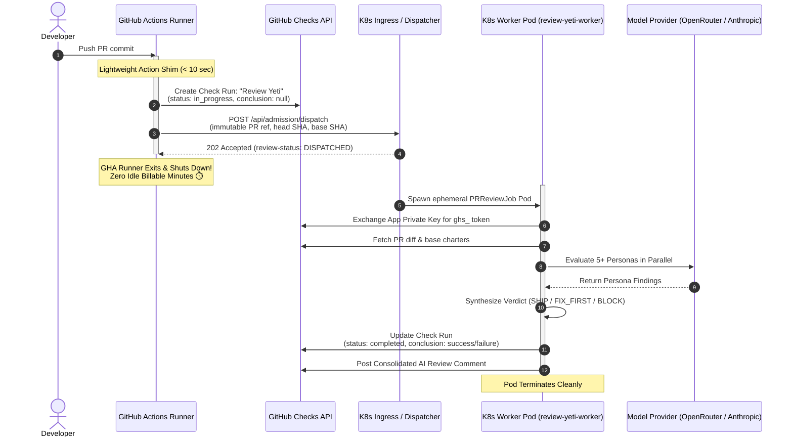

# ☸️ Kubernetes & DOKS Execution Mode

This guide explains how to run Review Yeti in **Kubernetes Mode** (DigitalOcean Kubernetes / DOKS, EKS, GKE, AKS, or any vanilla K8s cluster).

Running Review Yeti in Kubernetes offloads multi-persona AI reviews from expensive GitHub Actions runner minutes to containerized worker pods in your own cluster, **eliminating 95%+ of billable CI runner wait time**.

---

## 💡 The Problem: CI Runner Minute Waste

When running AI code reviews with 5 to 12 parallel personas (Security, Performance, Architecture, Quality, Dependencies, etc.), deep diff analysis, LLM response generation, and arbitration typically take **3 to 8 minutes**.

| Execution Mode | GHA Runner Runtime | Billable Runner Cost | Runner Queue Impact |
| :--- | :--- | :--- | :--- |
| **Traditional In-Runner Action** | 3 – 8 minutes per PR push | 💸 High ($0.008–$0.032/min x vCPUs x pushes) | 🔴 Ties up CI slots, blocks test pipelines |
| **Kubernetes Worker Mode** 🚀 | **< 10 seconds** (fire-and-forget shim) | ⚡ Virtually zero billable runner minutes | 🟢 Unblocks CI queue immediately |

In high-volume engineering teams with dozens of PR pushes per day, running AI reviews directly inside GitHub Actions or third-party cloud runners exhausts concurrency quotas and creates lengthy CI bottlenecks.

---

## 🚀 The Solution: Asynchronous Dispatch Handshake

Review Yeti's Kubernetes Mode decouples the **CI trigger** from **AI execution**:



### Key Handshake Properties:
1. **Fire-and-Forget Shim**: The GitHub Action runs a lightweight dispatch step that contacts the Kubernetes cluster and exits in under 10 seconds.
2. **Immediate Gate Registration**: The shim creates an in-progress Check Run (`review-status: DISPATCHED`, `gate-decision: PENDING`), preventing the PR from merging before review finishes.
3. **Direct Check Run Completion**: When the Kubernetes worker finishes its evaluation, it directly updates the GitHub Check Run (`conclusion: success` or `failure`) using its GitHub App token.
4. **No Runner Idle Cost**: The CI runner is released immediately while the LLMs think in the background.

---

## 🏗️ Architecture & Components

The Review Yeti Kubernetes runtime consists of three lightweight components:

1. **Dispatcher / Admission Service (`action-dispatch`)**:
   - Exposed via Ingress with TLS.
   - Verifies incoming dispatch signatures or OIDC tokens from GitHub Actions.
   - Enforces repository allowlists and concurrency limits.
   - Dispatches review jobs to the cluster.
2. **Review Yeti Operator (`k8s-operator`)**:
   - Manages the `PRReviewJob` Custom Resource Definition (CRD).
   - Reconciles review requests into ephemeral Kubernetes Jobs.
   - Enforces execution timeouts and lifecycle cleanup.
3. **Worker Runtime Pod (`review-yeti-worker`)**:
   - Minimal distroless/Node container image (`Dockerfile.worker`).
   - Runs `node dist/cli/runLiveReview.js`.
   - Mounts GitHub App credentials and provider keys securely from Kubernetes Secrets.

---

## 🛠️ Step-by-Step Kubernetes Deployment

### Step 1: Create Namespace and RBAC

Apply the isolated namespace and service account configurations from the `k8s/` directory:

```bash
# 1. Create namespace
kubectl apply -f k8s/namespace.yaml

# 2. Apply dispatcher and worker RBAC
kubectl apply -f k8s/rbac.yaml
kubectl apply -f k8s/worker-rbac.yaml
```

---

### Step 2: Deploy Secrets

Store your GitHub App credentials and LLM provider keys in a Kubernetes Secret:

```bash
kubectl create secret generic review-yeti-secrets \
  --namespace review-yeti-system \
  --from-literal=APP_ID="123456" \
  --from-literal=INSTALLATION_ID="98765432" \
  --from-file=PRIVATE_KEY="/path/to/review-yeti-app.pem" \
  --from-literal=DISPATCH_TOKEN="$(openssl rand -hex 32)" \
  --from-literal=OPENROUTER_API_KEY="sk-or-v1-..." \
  --dry-run=client -o yaml | kubectl apply -f -
```

---

### Step 3: Deploy the Operator and Dispatcher

Render and deploy the dispatcher and operator manifests:

```bash
# Deploy Review Yeti Dispatcher
envsubst < k8s/action-dispatch.yaml.tpl | kubectl apply -f -

# Deploy Operator
envsubst < k8s/operator-deployment.yaml.tpl | kubectl apply -f -

# Apply Ingress (configure your domain, e.g. review-bot.example.com)
kubectl apply -f k8s/ingress-network.yaml
```

Verify that the pods are healthy:

```bash
kubectl get pods -n review-yeti-system
```

---

## 📦 Configuring Consumer Repositories

Add a simple, ultra-fast workflow to any repository you want reviewed via Kubernetes:

```yaml
# .github/workflows/review-yeti.yml
name: Review Yeti (Kubernetes Mode)

on:
  pull_request:
    types: [opened, synchronize, reopened, ready_for_review]

jobs:
  dispatch:
    runs-on: ubuntu-latest
    permissions:
      contents: read
      pull-requests: read
      checks: write
    steps:
      - name: Dispatch Review to Kubernetes Cluster
        uses: review-yeti-ai/review-yeti-bot@v1
        with:
          execution-backend: doks   # or generic kubernetes
          dispatch-url: https://review-bot.example.com/api/admission/dispatch
          dispatch-token: ${{ secrets.REVIEW_DISPATCH_SECRET }}
```

> [!NOTE]
> This job completes in **5 to 10 seconds**! The GitHub Check Run named **Review Yeti** will remain `in_progress` until your Kubernetes worker completes the analysis and posts the final verdict.

---

## 📊 Sizing, Concurrency & Cost Analysis

### Resource Sizing for Worker Pods

Review Yeti workers are I/O and network bound (waiting on streaming LLM completions) rather than CPU-intensive:

```yaml
resources:
  requests:
    cpu: "250m"
    memory: "512Mi"
  limits:
    cpu: "1000m"
    memory: "1Gi"
```

Because of this small footprint:
- A modest 2-node K8s cluster (e.g., 2 x 4 vCPU nodes) can comfortably run **10–15 concurrent PR reviews** in parallel without queueing.
- Cost on DOKS or managed K8s: ~$40–$80/month fixed, regardless of whether you run 100 or 10,000 reviews!

### Monthly Savings Comparison

| Daily PR Volume | Monthly GHA Runner Cost (avg 5 min/run) | Monthly K8s Worker Cost | **Net Savings** |
| :--- | :--- | :--- | :--- |
| **25 PRs / day** | ~$150 / month | ~$48 / month (small cluster) | **~68% savings** |
| **100 PRs / day** | ~$600 / month | ~$48 / month | **~92% savings** |
| **500 PRs / day** | ~$3,000 / month | ~$96 / month | **~97% savings** |

---

## 🔍 Monitoring & Troubleshooting

### Viewing Real-Time Review Logs

Check the logs of running worker jobs:

```bash
# List active review jobs
kubectl get jobs -n review-yeti-system

# Stream logs from the latest review worker
kubectl logs -n review-yeti-system -l app.kubernetes.io/component=worker --tail=100 -f
```

### Checking Dispatcher Health

Query the dispatcher health check:

```bash
curl -i https://review-bot.example.com/health
```

Expected response:
```json
{
  "status": "healthy",
  "activeJobs": 2,
  "queueDepth": 0
}
```
