# 🚀 Review Yeti — Friendly Onboarding Guide

Welcome to **Review Yeti**! This guide walks you through setting up multi-persona AI code reviews, local pre-commit security gates, and interactive PR chat mentoring on your repositories in under 60 seconds.

---

## ⚡ Quickstart Option A: 30-Second GitHub App Wizard (Recommended)

The fastest, zero-friction way to set up Review Yeti with full superpowers—native Check Runs, 1-click commit suggestions, and interactive PR chat—is using the automated CLI onboarding wizard:

```bash
# Run the 30-second GitHub App Setup Wizard
npx review-yeti init
```

### What `review-yeti init` Does Automatically:
1. Generates an exact **least-privilege GitHub App manifest** (`checks: write`, `pull_requests: write`, `contents: read`, `issues: write`).
2. Launches your browser to GitHub's pre-configured app creation page.
3. Automatically exchanges the callback authorization code for your **App ID**, **Private Key PEM**, and **Webhook Secret**.
4. Writes a restricted local `.env` configuration (`mode 0o600`) and updates `.gitignore` to prevent credential leaks.
5. (Optional) With `--gh-secrets`, synchronizes credentials directly into your GitHub repository secrets via the GitHub CLI (`gh secret set`).

```bash
# Example: Non-interactive setup for an organization
npx review-yeti init --org my-org --gh-secrets --repo my-org/my-repo
```

👉 **For all CLI options and flags, see the [CLI Reference](CLI_REFERENCE.md).**

---

## ⚡ Quickstart Option B: 60-Second Standalone GitHub Action

If you prefer a pure YAML setup without creating a GitHub App, you can run Review Yeti directly inside GitHub Actions runners:

### 1. Add the Workflow File

Create `.github/workflows/review-yeti.yml` in your repository:

```yaml
# .github/workflows/review-yeti.yml
name: Review Yeti

on:
  pull_request:
    types: [opened, synchronize, reopened, ready_for_review]

jobs:
  review:
    runs-on: ubuntu-latest
    permissions:
      contents: read
      pull-requests: write
    steps:
      - name: Run Review Yeti
        uses: review-yeti-ai/review-yeti-bot@v1
        with:
          llm-api-key: ${{ secrets.OPENROUTER_API_KEY }}
          model: deepseek/deepseek-v4-flash-0731
```

### 2. Add Your LLM API Key

1. Go to your repository's **Settings** > **Secrets and variables** > **Actions**.
2. Click **New repository secret**.
3. Name: `OPENROUTER_API_KEY` (or your preferred OpenAI-compatible provider key).
4. Value: Paste your API key (e.g. from [OpenRouter](https://openrouter.ai)).

### 3. Open a Pull Request! 🎉

Open a pull request on your repository. Review Yeti will automatically:
1. Inspect the pull request diff over the GitHub API (no git checkout needed!).
2. Evaluate it in parallel across 5 built-in expert personas (Security, Architecture, Performance, QA, Dependencies).
3. Reconcile findings through automated arbitration.
4. Post a clean, consolidated review comment with clear severity ratings (P0, P1, P2) and an actionable verdict (`SHIP`, `FIX_FIRST`, or `BLOCK`).

---

## 💻 Local Developer Superpowers: Pre-Commit CLI & Hooks

Catch credentials and code defects locally before they reach GitHub:

```bash
# 1. Run local pre-commit check on staged files (< 5 seconds)
npx review-yeti pre-commit

# 2. Install as an automated git pre-commit hook
npx review-yeti install-hook
```

- **Sub-10ms Credential Checks**: Scans for AWS keys, GitHub tokens, and private keys.
- **Blocking P0 Exits**: Automatically cancels `git commit` if critical blockers are found.
- **Husky Integration**: Supports `npx review-yeti install-hook --husky`.

---

## 🏛️ Choose Your Organization Deployment Pattern

Review Yeti scales from a single weekend project to an enterprise fleet of hundreds of repositories. Choose the pattern that best fits your team:

```mermaid
graph TD
    subgraph Pattern 1: Standalone Action
        A[Repo A PR] -->|Runs directly in GHA runner| B[Review Yeti Action @v1]
        B -->|OpenRouter / Anthropic| LLM1[LLM Provider]
    end

    subgraph Pattern 2: Centralized Reusable Hub
        C[Repo A PR] -->|uses: my-org/ci-hub/.github/workflows/review.yml| HUB[Central Workflow Hub]
        D[Repo B PR] -->|uses: my-org/ci-hub/.github/workflows/review.yml| HUB
        HUB -->|Centralized Secrets & Policy| LLM2[LLM Provider]
    end

    subgraph Pattern 3: Kubernetes Scaled Cluster
        E[Repo A PR] -->|Lightweight shim < 10s| K8S[Kubernetes Review Cluster]
        F[Repo B PR] -->|Lightweight shim < 10s| K8S
        K8S -->|Ephemeral Worker Pods| LLM3[LLM Provider]
        K8S -->|Direct Check Run & Comment| GH[GitHub API]
    end
```



### Pattern 1: Standalone GitHub Action (Simplest)
- **Best for**: Small teams, individual repositories, or testing Review Yeti.
- **Setup**: One YAML file in each repository.
- **Runner**: Executes directly inside GitHub Actions runner (`ubuntu-latest`).

### Pattern 2: Centralized Reusable Workflow Hub (Recommended for Orgs)
- **Best for**: Organizations managing 5 to 50+ repositories wanting central secret and model management.
- **Setup**: Create a central repository (e.g., `my-org/review-actions`) containing a reusable workflow.
- **Benefit**: Individual repos only need a 5-line caller workflow; secrets like `OPENROUTER_API_KEY` or GitHub App credentials live only in the central hub repository!

```yaml
# In consumer repo: .github/workflows/review.yml
name: AI Code Review
on: pull_request

jobs:
  review:
    uses: my-org/review-actions/.github/workflows/review-yeti.yml@v1
    secrets: inherit
```

### Pattern 3: Kubernetes Scaled Cluster (High Volume / Cost Optimized)
- **Best for**: Organizations with high PR volume seeking to eliminate billable CI runner minutes.
- **Setup**: Deploy the Review Yeti Operator & Dispatcher in your Kubernetes cluster (DOKS, EKS, GKE, etc.).
- **Benefit**: GHA runner dispatches review in **< 10 seconds** and terminates; Kubernetes worker pods handle the LLM evaluations.
- **Guide**: See [Kubernetes & DOKS Execution Mode](KUBERNETES_MODE.md).

---

## 👥 Meet Your AI Review Panel

Review Yeti does not use a generic single prompt. It assembles a **panel of specialized personas**, each with a dedicated charter:

| Persona | Focus Area | What It Looks For |
| :--- | :--- | :--- |
| 🛡️ **Security & Tenancy** *(Default)* | Security vulnerabilities & data safety | SQL injection, auth bypass, tenant leaks, secrets in code, SSRF, XSS. |
| ⚡ **Performance & Scale** *(Default)* | Efficiency & resource consumption | N+1 queries, unindexed filters, unbounded memory allocations, blocking I/O. |
| 🏛️ **System Architecture** *(Default)* | Clean code & maintainability | Interface segregation, coupling, layer violations, design pattern misfits. |
| 🧪 **Quality & QA** *(Default)* | Test coverage & edge cases | Missing test cases, flaky tests, unhandled exceptions, concurrency hazards. |
| 📦 **Dependencies & Supply Chain** *(Default)* | Package safety | Deprecated libraries, vulnerable dependencies, licensing conflicts. |
| 🗄️ **Database Specialist** *(Optional)* | Data integrity & migrations | Table locking migrations, index selection, transaction safety. |
| 🌐 **Accessibility & Frontend** *(Optional)* | UX & web standards | WCAG contrast, ARIA tags, keyboard navigation, responsiveness. |

---

## 🛠️ Customizing Review Rules for Your Codebase

### 1. Repository Configuration (`.ct-review.yaml`)

Add a `.ct-review.yaml` to the root of your repository to enable/disable personas or customize thresholds:

```yaml
# .ct-review.yaml
version: 3

# Which personas to run
personas:
  - id: security
    enabled: true
  - id: performance
    enabled: true
  - id: database
    enabled: true        # Enable optional database specialist
  - id: accessibility
    enabled: false

# Path filters - ignore generated files, lockfiles, or vendor directories
path_filters:
  - "dist/**"
  - "build/**"
  - "node_modules/**"
  - "vendor/**"
  - "package-lock.json"
  - "yarn.lock"
```

### 2. Adding Custom Persona Charters (`.ct-review/personas/*.md`)

Teach Review Yeti your team's specific architectural patterns by creating Markdown charters under `.ct-review/personas/`:

```markdown
<!-- .ct-review/personas/tenancy.md -->
---
name: "🏢 Multi-Tenant Isolation Specialist"
---

Every database query touching tenant data must be explicitly scoped by `orgId`.

## What to flag (P1):
- Database queries accepting an un-scoped `id` without an `orgId` constraint.
- API endpoints reading customer data that omit tenant authentication context.
- In-memory cache keys that omit the `tenant_` prefix.

## What to ignore:
- Superadmin system scripts under `scripts/admin/`.
- Database schema migration files.
```

> [!TIP]
> **Base Ref Authority**: Review Yeti reads charters from the pull request's **base branch** (e.g. `main`), preventing pull requests from tampering with their own review rules!

---

## 🚦 Merge Gates & Branch Protection

Review Yeti assigns a clear verdict to each review:

- 🟢 **`SHIP`**: Diff is clean. Zero P0 or P1 issues. Ready to merge!
- 🟡 **`FIX_FIRST`**: Non-blocking improvements or minor bugs recommended before shipping.
- 🔴 **`BLOCK`**: Critical issue identified (e.g. P0 security vulnerability, data loss risk).

### Enforcing Review Yeti in GitHub Branch Protection

1. In your GitHub repository, go to **Settings** > **Branches**.
2. Click **Edit** on your branch protection rule (e.g. `main`).
3. Check **Require status checks to pass before merging**.
4. In the search box, select **Review Yeti**.
5. Save changes.

Pull requests with a `BLOCK` verdict will automatically be blocked from merging until resolved!

---

## ❓ Frequently Asked Questions (FAQ)

<details>
<summary><b>Does Review Yeti send my entire codebase to the LLM?</b></summary>
<br/>
No. Review Yeti extracts and analyzes only the <b>exact unified diff</b> of the pull request, bounded by character limits (default 24,000 chars with intelligent hunk partitioning). Your uncommitted or unchanged files are never transmitted.
</details>

<details>
<summary><b>Which LLM models work best with Review Yeti?</b></summary>
<br/>
Review Yeti supports any OpenAI-compatible endpoint. Highly recommended models:
- <b>DeepSeek V3 / V4 Flash</b>: Outstanding speed, reasoning, and cost-efficiency.
- <b>Claude 3.5 Sonnet / Sonnet 4</b>: Industry-leading nuance and low hallucination rate.
- <b>Gemini 2.5 / 3.0 Flash</b>: Ultra-low latency and generous context windows.
- <b>Self-hosted Ollama / vLLM</b>: Completely private on-prem execution.
</details>

<details>
<summary><b>Why should I configure a GitHub App instead of GITHUB_TOKEN?</b></summary>
<br/>
A GitHub App provides native Check Runs API access, independent API rate limits (5,000+ req/hr), and clean bot attribution. See the <a href="GITHUB_APP_SETUP.md">GitHub App Setup Guide</a> for details.
</details>

---

## 📚 Next Steps

- [CLI Reference & Git Hook Guide](CLI_REFERENCE.md) — Fast pre-commit checks, 30-second setup wizard, and hook installers.
- [Interactive PR Chat Guide](INTERACTIVE_CHAT.md) — Conversational code mentoring with `@review-yeti explain`, `fix`, and `ignore`.
- [Team Memory & Nit Suppression Guide](TEAM_MEMORY.md) — Persistent SQLite WAL reflection and community persona charters.
- [GitHub App Setup Guide](GITHUB_APP_SETUP.md) — Manual GitHub App registration and permissions matrix.
- [Helm 3 Operations Guide](HELM_GUIDE.md) — Production Kubernetes cluster deployment.
- [Kubernetes & DOKS Execution Mode](KUBERNETES_MODE.md) — Offload review workloads to your cluster and eliminate runner waste.
- [Configuration Reference](CONFIGURATION_REFERENCE.md) — Complete `.ct-review.yaml` schema and options.
- [Architecture Deep Dive](ARCHITECTURE.md) — How Review Yeti's consensus and arbitration engine works.
