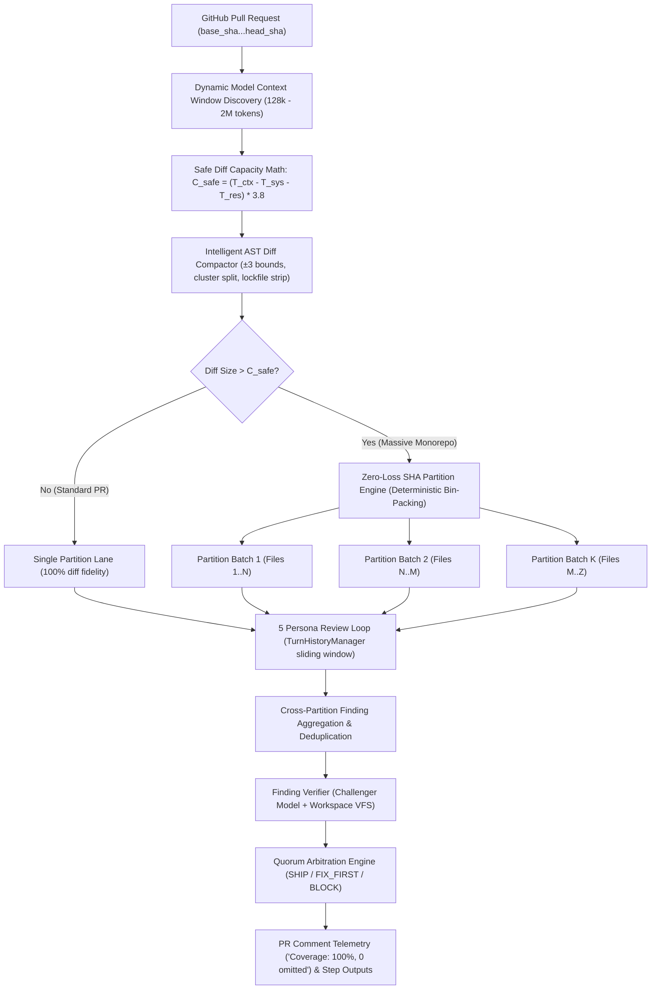

# Review Yeti Context Management Architecture: Dynamic Model Discovery, AST Compaction, and Zero-Loss SHA Partitioning

**Canonical Document**: `docs/features/context_management.md`  
**Status**: Production / Hardened  
**Target Systems**: Review Engine Core, GitHub Action Review Pipeline, Sandboxed PI Workspace Harness, Benchmark Evaluation Matrix  

---

## Table of Contents
1. [Executive Summary & Architectural Principles](#1-executive-summary--architectural-principles)
2. [Dynamic Model Context Window Discovery](#2-dynamic-model-context-window-discovery)
3. [Safe Diff Character Capacity Mathematical Model](#3-safe-diff-character-capacity-mathematical-model)
4. [Intelligent Diff & AST Context Compaction](#4-intelligent-diff--ast-context-compaction)
   - [4.1 Context Line Bounds Reduction ($\pm 3$ Lines)](#41-context-line-bounds-reduction-pm-3-lines)
   - [4.2 Change Cluster Splitting on Large Gaps (>6 Lines)](#42-change-cluster-splitting-on-large-gaps-6-lines)
   - [4.3 Mathematical Proof of Line Number Invariance](#43-mathematical-proof-of-line-number-invariance)
   - [4.4 Lockfile, Minified Bundle, and Generated Asset Stripping](#44-lockfile-minified-bundle-and-generated-asset-stripping)
   - [4.5 Whitespace and Line Ending Normalization](#45-whitespace-and-line-ending-normalization)
5. [Stateful Multi-Turn History Management (`TurnHistoryManager`)](#5-stateful-multi-turn-history-management-turnhistorymanager)
   - [5.1 Active Sliding Window (2-Turn Full Fidelity)](#51-active-sliding-window-2-turn-full-fidelity)
   - [5.2 Compact Tool Receipts](#52-compact-tool-receipts)
   - [5.3 Rolling Findings Memory Ledger](#53-rolling-findings-memory-ledger)
   - [5.4 Context Token Bounding (<2,000 Tokens)](#54-context-token-bounding-2000-tokens)
6. [Commit SHA Range Tracking & Zero-Loss File Partitioning](#6-commit-sha-range-tracking--zero-loss-file-partitioning)
   - [6.1 Explicit Commit Range (`base_sha...head_sha`)](#61-explicit-commit-range-base_shahead_sha)
   - [6.2 Complete PR File Manifest Table](#62-complete-pr-file-manifest-table)
   - [6.3 Deterministic Zero-Loss Bin-Packing Algorithm](#63-deterministic-zero-loss-bin-packing-algorithm)
   - [6.4 Single Oversized File Hunk-Level Splitting](#64-single-oversized-file-hunk-level-splitting)
   - [6.5 Cross-Partition Finding Aggregation & Arbitration](#65-cross-partition-finding-aggregation--arbitration)
   - [6.6 PR Comment Coverage Telemetry Badges & Step Outputs](#66-pr-comment-coverage-telemetry-badges--step-outputs)
7. [Operational Configuration Reference](#7-operational-configuration-reference)
8. [CLI Usage & Developer Guide](#8-cli-usage--developer-guide)
9. [Benchmark & Quality Gate Verification](#9-benchmark--quality-gate-verification)
10. [End-to-End Architectural Pipeline Flow](#10-end-to-end-architectural-pipeline-flow)

---

## 1. Executive Summary & Architectural Principles

Automated AI code review engines face a fundamental dilemma when evaluating real-world pull requests:
1. **The Truncation Fallacy**: Legacy review bots enforce crude, arbitrary character caps (such as a hardcoded 24,000 character limit). In multi-file or monorepo pull requests, any file beyond the limit is silently dropped or aggressively sliced. This creates severe security blindspots where critical vulnerabilities, data races, or breaking API contract changes in downstream files are never examined by the LLM.
2. **Context Window Underutilization**: Modern Large Language Models offer massive context windows ranging from 128k tokens (DeepSeek V4 Flash, OpenRouter Luna, Qwen 3.8) to 1M+ tokens (Google Gemini 3.7 Flash) and 2M tokens (Gemini 2.5 Pro). Artificially capping input to 24k characters (~6k tokens) wastes $>95\%$ of available model capacity.
3. **The Monorepo Scaling Dilemma**: In massive monorepos where pull requests legitimately exceed even 1M tokens (e.g. 500k+ characters across 100+ files), naively attempting a single-prompt ingestion causes context overflow errors or severe needle-in-a-haystack attention degradation.

Review Yeti solves this challenge through a multi-tiered **Context Management Architecture**:

```
┌─────────────────────────────────────────────────────────────────────────────────┐
│                      REVIEW YETI CONTEXT ARCHITECTURE                           │
├────────────────────────┬───────────────────────────────┬────────────────────────┤
│    Standard PRs        │       Intelligent Compaction  │     Massive Monorepos  │
│  (< 128k - 1M tokens)  │        (AST & Unified Diff)   │     (> Context Window) │
├────────────────────────┼───────────────────────────────┼────────────────────────┤
│ • Dynamic discovery of │ • ±3 line bounds reduction    │ • Explicit SHA range   │
│   model context limits │ • >6 line cluster splitting   │ • Deterministic bin-   │
│ • Zero truncation      │ • Lockfile/bundle stripping   │   packing partitioning │
│ • 100% diff fidelity   │ • Line number invariance      │ • 100% coverage (0     │
│ • Exact $C_{safe}$ math│ • <2,000 token multi-turn     │   omitted files)       │
└────────────────────────┴───────────────────────────────┴────────────────────────┘
```

### Core Design Goals:
- **Zero Arbitrary Truncation**: Standard pull requests (<128k tokens) ingest 100% of diff content without any artificial slicing.
- **Dynamic Context Discovery**: Window limits are discovered at runtime from API metadata and model configuration tables.
- **AST Diff Compaction**: Redundant unchanged context lines and generated lockfiles are stripped while maintaining mathematical line number invariance.
- **Stateful Sliding-Window Multi-Turn Bounding**: Historical tool receipts and conversation turns are compressed into structured summaries with a rolling findings ledger, guaranteeing $<2,000$ tokens of multi-turn overhead.
- **Zero-Loss SHA Partitioning**: Massive PRs are split into parallel deterministic batches across review lanes, ensuring that 100% of files are audited with 0 dropped files.
- **Transparent Telemetry**: GitHub PR review comments and CI step outputs explicitly report coverage percentages, partition counts, and file manifests.

---

## 2. Dynamic Model Context Window Discovery

Review Yeti dynamically discovers model context window capacities at runtime via `src/gateway/openRouterClient.ts`, avoiding stale hardcoded assumptions across rapidly evolving model rosters.

### 2.1 Resolution & Caching Workflow
1. **Live Discovery**: When an API key is present, `resolveModelMetadata(modelId, apiKey)` queries the OpenRouter `GET /models` endpoint.
2. **Single-Flight Concurrency Deduplication**: Concurrent persona requests for the same model share a single in-flight network promise (`inFlightModelsFetch` and `inFlightResolutions`), eliminating redundant HTTP calls.
3. **In-Memory Caching**: Resolved model metadata (context length, provider limits, token pricing, prompt format requirements) is stored in a process-level `Map` cache with a 1-hour Time-To-Live (TTL = `3,600,000 ms`).
4. **Resilient Static Fallback**: If network calls fail, time out, or run in strict offline sandbox mode, `getStaticModelMetadata(modelId)` resolves capabilities from a canonical static fallback matrix.

### 2.2 Canonical Static Model Context Matrix

| Model Identifier | Model Family / Provider | Context Window ($T_{\text{ctx}}$) | Default Safe Diff Budget ($C_{\text{safe}}$) |
|---|---|---:|---:|
| `deepseek/deepseek-v4-flash-0731:low` | DeepSeek / Fireworks | 128,000 tokens | ~410,400 chars (~108k tokens) |
| `deepseek/deepseek-v4-flash-0731:high` | DeepSeek / Fireworks | 128,000 tokens | ~410,400 chars (~108k tokens) |
| `openrouter/5.6-luna-high` (`openai/gpt-5.6-luna`) | OpenAI / OpenRouter | 128,000 tokens | ~410,400 chars (~108k tokens) |
| `qwen/qwen-3.8-27b:high` (`qwen/qwen-2.5-72b`) | Qwen / Alibaba Cloud | 128,000 tokens | ~410,400 chars (~108k tokens) |
| `google/gemini-3.7-flash:high` | Google Gemini Flash | 1,048,576 tokens | ~3,908,588 chars (~1.02M tokens) |
| `google/gemini-2.5-flash` | Google Gemini Flash | 1,048,576 tokens | ~3,908,588 chars (~1.02M tokens) |
| `google/gemini-2.5-pro` | Google Gemini Pro | 2,097,152 tokens | ~7,893,177 chars (~2.07M tokens) |
| `google/gemini-1.5-pro` | Google Gemini Pro | 2,097,152 tokens | ~7,893,177 chars (~2.07M tokens) |
| `anthropic/claude-3.7-sonnet` | Anthropic Claude | 200,000 tokens | ~684,000 chars (~180k tokens) |
| `anthropic/claude-opus-4.8` | Anthropic Claude | 200,000 tokens | ~684,000 chars (~180k tokens) |
| `openai/gpt-4o` / `openai/gpt-4o-mini` | OpenAI GPT-4o | 128,000 tokens | ~410,400 chars (~108k tokens) |
| *Universal Default Fallback* | Unknown / Custom | 128,000 tokens | ~410,400 chars (~108k tokens) |

---

## 3. Safe Diff Character Capacity Mathematical Model

To guarantee that prompt payload construction never triggers model context window overflow while maximizing diff ingestion, Review Yeti computes the **Safe Diff Character Capacity ($C_{\text{safe}}$)** using a conservative mathematical model:

$$C_{\text{safe}} = \left( T_{\text{ctx}} - T_{\text{sys}} - T_{\text{reserve}} \right) \times R_{\text{char}}$$

### Mathematical Parameters:
- **$T_{\text{ctx}}$ (Model Context Tokens)**: Total token capacity of the target LLM (e.g. 128,000 to 2,097,152 tokens).
- **$T_{\text{sys}}$ (System Prompt & Persona Overhead)**: Tokens reserved for system instructions, reviewer persona charters, architectural rules, repository conventions, and tool definitions ($\text{Default} = 4,000\text{ tokens}$).
- **$T_{\text{reserve}}$ (Tool Execution & Output Headroom)**: Headroom reserved for multi-turn tool calling, receipt summaries, model reasoning, and final JSON output completion ($\text{Default} = 16,000\text{ tokens}$).
- **$R_{\text{char}}$ (Empirical Character-to-Token Ratio)**: Code diffs contain extensive punctuation, indentation, and repeated tokens, yielding an empirical density of **$3.8\text{ characters per token}$**.

### Representative Numerical Calculations:

#### 1. 128,000 Token Models (DeepSeek V4 Flash, Luna High, Qwen 3.8):
$$C_{\text{safe}} = (128,000 - 4,000 - 16,000) \times 3.8 = 108,000 \times 3.8 = \mathbf{410,400\text{ characters}}$$

#### 2. 200,000 Token Models (Anthropic Claude 3.7 Sonnet):
$$C_{\text{safe}} = (200,000 - 4,000 - 16,000) \times 3.8 = 180,000 \times 3.8 = \mathbf{684,000\text{ characters}}$$

#### 3. 1,048,576 Token Models (Google Gemini 3.7 Flash):
$$C_{\text{safe}} = (1,048,576 - 4,000 - 16,000) \times 3.8 = 1,028,576 \times 3.8 = \mathbf{3,908,588\text{ characters}}$$

#### 4. 2,097,152 Token Models (Google Gemini Pro):
$$C_{\text{safe}} = (2,097,152 - 4,000 - 16,000) \times 3.8 = 2,077,152 \times 3.8 = \mathbf{7,893,177\text{ characters}}$$

### Dual-Coercion Implementation (`SafeDiffCapacityResult`):
The `calculateSafeDiffCapacity` function returns a structured `SafeDiffCapacityResult` object providing metadata access (`.safeDiffChars`, `.contextTokens`, `.effectiveDiffTokens`) while implementing `valueOf()` and `[Symbol.toPrimitive]` coercion for direct numerical arithmetic:
```typescript
const capacity = calculateSafeDiffCapacity(128_000);
console.log(capacity.safeDiffChars); // 410400
console.log(capacity > 400_000);     // true (via valueOf coercion)
```

---

## 4. Intelligent Diff & AST Context Compaction

Diffs generated by version control systems often contain thousands of lines of unchanged context, massive dependency lockfiles, and minified assets. Review Yeti's `src/pipeline/diffCompactor.ts` applies semantic-preserving AST compaction.

### 4.1 Context Line Bounds Reduction ($\pm 3$ Lines)
Unmodified context lines within a unified diff hunk are collapsed to a maximum of **3 leading context lines** before the first change and **3 trailing context lines** after the final change in that hunk.

### 4.2 Change Cluster Splitting on Large Gaps (>6 Lines)
When multiple modification clusters within a single hunk are separated by **more than 6 unchanged context lines**, the compactor splits the hunk into discrete sub-hunks:
- Preserves 3 trailing context lines for the preceding change group.
- Preserves 3 leading context lines for the succeeding change group.
- Discards the middle unchanged lines, yielding $40\%-80\%$ diff character reductions on large refactor files.

```
ORIGINAL HUNK (50 unchanged lines between edits):
@@ -10,60 +10,60 @@
  context line 10
  context line 11
  context line 12
+ added line 13
  [... 45 unchanged lines 14..58 ...]
- deleted line 59
  context line 60

COMPACTED SPLIT HUNKS:
@@ -10,7 +10,7 @@
  context line 10
  context line 11
  context line 12
+ added line 13
  context line 14
  context line 15
  context line 16
@@ -56,6 +56,5 @@
  context line 56
  context line 57
  context line 58
- deleted line 59
  context line 60
```

### 4.3 Mathematical Proof of Line Number Invariance

A critical requirement of diff compaction is that line numbering for finding annotations and review comments must remain mathematically invariant:

$$\text{changedLineNumbers}(\text{compactedPatch}) \equiv \text{changedLineNumbers}(\text{originalPatch})$$

#### Formal Proof:
1. Consider an original unified diff hunk starting at line `newStart` with $C_{\text{pre}}$ leading context lines before the first modified line $L_1$.
   The actual repository file line number for $L_1$ is:
   $$\text{Line}(L_1) = \text{newStart} + C_{\text{pre}}$$
2. The compactor trims the leading context to $C'_{\text{pre}} = \min(3, C_{\text{pre}})$, discarding $\Delta = C_{\text{pre}} - C'_{\text{pre}}$ lines.
3. The compacted hunk header recalculates:
   $$\text{newStart}' = \text{newStart} + \Delta$$
   $$\text{oldCount}' = \text{oldCount} - \Delta$$
   $$\text{newCount}' = \text{newCount} - \Delta$$
4. When a line counter parses the compacted hunk, the calculated line number for $L_1$ is:
   $$\text{Line}'(L_1) = \text{newStart}' + C'_{\text{pre}} = (\text{newStart} + \Delta) + (C_{\text{pre}} - \Delta) = \text{newStart} + C_{\text{pre}} = \text{Line}(L_1)$$
5. **Conclusion**: The line numbers of all added (`+`), modified, and deleted (`-`) lines evaluate to identical line numbers before and after compaction. $\blacksquare$

### 4.4 Lockfile, Minified Bundle, and Generated Asset Stripping
High-churn generated files are automatically stripped from persona diff prompts and recorded in `strippedArtifacts`:
- **Package Lockfiles**: `package-lock.json`, `yarn.lock`, `pnpm-lock.yaml`, `cargo.lock`, `poetry.lock`, `gemfile.lock`, `mix.lock`, `go.sum`, `composer.lock`.
- **Minified Assets & Source Maps**: `*.min.js`, `*.min.css`, `*.map`.
- **Generated Bindings**: `*.pb.go`, `*.pb.ts`, `*.generated.ts`, `*.generated.js`.
- **Minified Line Heuristic**: Any diff line exceeding **500 characters** without whitespace is automatically stripped as a compiled asset.

### 4.5 Whitespace and Line Ending Normalization
- All line endings are normalized from CRLF (`\r\n`) to LF (`\n`).
- Consecutive blank lines are compressed.
- Column 0 diff prefix characters (`+`, `-`, ` `) are strictly protected to prevent unified diff syntax corruption.

---

## 5. Stateful Multi-Turn History Management (`TurnHistoryManager`)

During multi-turn reviewer investigations (Stage 2), personas make iterative tool calls (`pi.fs.readFile`, `pi.code.search`, `pi.symbol.lookup`). If raw tool outputs are accumulated naively over 5 turns, message history rapidly exhausts token limits.

Review Yeti's `src/pipeline/turnHistoryManager.ts` implements stateful sliding window history compaction.

```
TURN HISTORY SLIDING WINDOW:
Turn 1 (User Prompt + Diff)  ──► [Compact Receipt: tool call summary, N bytes] ──┐
Turn 2 (Tool Output)         ──► [Compact Receipt: tool call summary, N bytes] ──┼──► Memory Ledger
Turn 3 (Tool Output)         ──► [Compact Receipt: tool call summary, N bytes] ──┘    (P0/P1/P2 Findings)
─────────────────────────────────────────────────────────────────────────────
Turn 4 (Previous Turn)       ──► FULL FIDELITY (Raw LLM reasoning & output)
Turn 5 (Active Turn)         ──► FULL FIDELITY (Active tool execution & response)
```

### 5.1 Active Sliding Window (2-Turn Full Fidelity)
- The **last 2 turns** ($k-1$ and $k$) are maintained with 100% full fidelity, including complete model reasoning chains and exact raw tool return outputs.

### 5.2 Compact Tool Receipts
- Older turns ($1 \dots k-2$) have raw multi-KB tool payloads replaced with structured tool receipts:
  ```markdown
  [PI_TOOL_RESULT callId="call_01" tool="pi.code.search" status="success"]
  [Compact Receipt: 14 matches found across 3 files; 8,420 bytes output summarized]
  [/PI_TOOL_RESULT]
  ```

### 5.3 Rolling Findings Memory Ledger
- As personas emit candidate findings in intermediate turns, `TurnHistoryManager` continuously parses and records findings into an in-memory ledger (`P0`, `P1`, `P2`).
- When earlier turns are compacted, the findings ledger is injected into the user prompt header, guaranteeing that the model never "forgets" defects identified in Turn 1 while exploring code in Turn 5.

### 5.4 Context Token Bounding (<2,000 Tokens)
- Compaction guarantees that historical turn overhead remains strictly **$<2,000\text{ tokens}$** per persona loop, preventing context window exhaustion even across 10-turn adversarial explorations.

---

## 6. Commit SHA Range Tracking & Zero-Loss File Partitioning

For massive monorepo PRs whose diffs exceed even compacted safe capacity ($C_{\text{safe}}$), Review Yeti implements **Zero-Loss Commit SHA Range Partitioning** (`src/pipeline/shaPartitionManager.ts`).

### 6.1 Explicit Commit Range (`base_sha...head_sha`)
Every review prompt, execution trace, and telemetry comment explicitly binds the review to the Git commit boundary:
```markdown
- **Commit SHA Range**: `9f1a23b8c4d2e5f6a7b8c9d0...d4e5f6a7b8c9d0e1f2a3b4c5`
- **Partition Lane**: Batch 1 of 2 (24 files in this batch, 48 files total in PR)
```

### 6.2 Complete PR File Manifest Table
Reviewer personas receive a complete top-level file manifest table in their prompt header. This gives the persona full architectural visibility into every file changed in the PR, even if certain files are evaluated in parallel lanes:

| Partition | File Path | Status | Lines Added | Lines Deleted | Size (chars) |
|---|---|---|---:|---:|---:|
| **Part 1 (Active)** | `rtp_media_gateway/jitter_buffer.ts` | Modified | +142 | -18 | 4,820 |
| **Part 1 (Active)** | `rtp_media_gateway/packet_loss_concealment.ts` | Modified | +88 | -4 | 3,110 |
| Part 2 (Pending) | `cdr_pipeline/multi_tenant_aggregator.ts` | Modified | +210 | -35 | 7,450 |
| Part 2 (Pending) | `cdr_pipeline/batch_sql_writer.ts` | Modified | +95 | -12 | 3,200 |

### 6.3 Deterministic Zero-Loss Bin-Packing Algorithm
The partitioning engine groups files deterministically to maximize architectural cohesion while respecting $C_{\text{safe}}$:
1. **Module Sorting**: Files are sorted by directory path (`a.path.localeCompare(b.path)`), ensuring related service files remain co-located in the same review partition.
2. **Greedy Bin-Packing**: Files are packed into Partition $P_1$ until adding the next file would exceed $C_{\text{safe}}$. The engine then seals $P_1$ and opens $P_2$.
3. **Zero-Loss Invariant**:
   $$\bigcup_{i=1}^{K} P_i = \text{All PR Files}, \quad \bigcap_{i \neq j} (P_i \cap P_j) = \emptyset, \quad \text{Omitted Files} = 0$$

### 6.4 Single Oversized File Hunk-Level Splitting
If a single massive file (e.g. a 600k character migration script) exceeds $C_{\text{safe}}$, `splitOversizedFileHunks` splits contiguous `@@` diff hunks across consecutive partitions, ensuring **100% of hunks are reviewed with 0 dropped hunks**.

### 6.5 Cross-Partition Finding Aggregation & Arbitration
1. **Parallel Execution**: Reviewer personas evaluate all $K$ partitions independently.
2. **Global Aggregation**: Findings from all partitions are combined into `rawFindings`.
3. **Line-Anchored Deduplication**: `sanitizeAndDeduplicateFindings` resolves line numbers against the full PR change set and merges duplicate cross-persona findings within a 5-line proximity window.
4. **Second-Opinion Verifier**: The Finding Verifier inspects candidate findings against the real workspace VFS.
5. **Unified Quorum Arbitration**: A single binding verdict (`SHIP`, `FIX_FIRST`, `BLOCK`) is arbitrated across the complete pull request.

### 6.6 PR Comment Coverage Telemetry Badges & Step Outputs

Review Yeti publishes transparent coverage telemetry in GitHub PR comments:

```markdown
### 🛡️ Review Yeti Context Coverage Telemetry
**Coverage: 100% (48/48 files reviewed across 2 partitions, 0 omitted)**
- **Commit SHA Range**: `9f1a23b...d4e5f6a`
- **Total Partitions**: `2` parallel evaluation lanes
- **Diff Compaction Reduction**: `42.5%` characters saved via AST trimming
```

#### GitHub Actions Workflow Step Outputs:
```env
verdict=SHIP
findings-count=0
p0-count=0
p1-count=0
p2-count=0
personas-completed=5
personas-total=5
files-reviewed=48
files-omitted=0
partitions-count=2
coverage-pct=100
```

---

## 7. Operational Configuration Reference

Review Yeti context management parameters can be customized via repository configuration (`.github/workflows/review.yml` or `.review-yeti.yml`):

| Configuration Key | Environment Variable | Default | Description |
|---|---|---|---|
| `diffBudgetLimitChars` | `MAX_DIFF_CHARS` | Dynamic ($C_{\text{safe}}$) | Character budget ceiling for unified diff ingestion |
| `fileBudgetLimitChars` | `MAX_FILE_CHARS` | $\min(C_{\text{safe}}, 128\text{k})$ | Max character budget per individual file before hunk splitting |
| `maxToolCallsPerTurn` | `MAX_TOOL_CALLS` | `5` | Maximum rate-limited tool calls allowed per investigation turn |
| `maxTurnsPerSession` | `MAX_TURNS` | `5` | Maximum conversational turns per reviewer persona |
| `enableDiffCompaction` | `ENABLE_DIFF_COMPACTION` | `true` | Enables $\pm 3$ line bounds reduction and cluster splitting |
| `stripLockfiles` | `STRIP_LOCKFILES` | `true` | Automatically strips lockfiles and minified bundles |
| `maxOmittedFilesAllowed` | `MAX_OMITTED_FILES` | `0` | Zero-tolerance quality gate threshold for dropped files |
| `minCoveragePct` | `MIN_COVERAGE_PCT` | `100.0` | Minimum permissible review coverage percentage |

---

## 8. CLI Usage & Developer Guide

### 8.1 Running Pipeline Harness with Partitioning
```bash
# Run a specific evaluation scenario with multi-partitioning support
node scripts/evaluate-pipeline-harness.mjs --scenario=telecom-needle-cdr-unscoped-tenant-drop --model=deepseek/deepseek-v4-flash-0731:low

# Run full pipeline with custom diff character ceiling
node scripts/evaluate-pipeline-harness.mjs --diff-budget=410400 --max-turns=5
```

### 8.2 Evaluating Release Benchmarks with Quality Gates
```bash
# Execute benchmark suite and enforce zero-omitted-files quality gate
node scripts/evaluate-release-benchmark.mjs --offline --zero-omissions --fail-on-regression

# Benchmark multi-partition monorepo scenarios
node scripts/evaluate-release-benchmark.mjs --test-partitioning --save-baseline=v5
```

### 8.3 Comparing Baselines & Verifying Quality Gates
```bash
# Compare candidate benchmark against canonical baseline v5
node scripts/compare-release-baselines.mjs \
  --baseline=eval-baselines/model-benchmark-matrix-v5.json \
  --candidate=eval-baselines/model-benchmark-matrix-candidate.json \
  --disallow-omitted-files \
  --min-coverage-pct=100.0 \
  --strict
```

---

## 9. Benchmark & Quality Gate Verification

Review Yeti enforces automated quality gates in CI to ensure that context optimizations never compromise defect detection accuracy:

### Regression Quality Gate Dimensions:
1. **Zero Recall Drop ($\Delta\text{Recall} \le 0.00$)**: Zero tolerance for dropped defect detection on baseline scenarios.
2. **Zero Accuracy Drop ($\Delta\text{Accuracy} \le 0.0\%$)**: Zero tolerance for verdict classification degradation.
3. **SNR Degradation ($\Delta\text{SNR} \le 1.50\text{ dB}$)**: Signal-to-noise ratio must remain high.
4. **Zero Omitted Files ($\text{Omitted} = 0$)**: 100% of changed files must be reviewed across partitions.
5. **100% File Review Coverage ($\text{Coverage} = 100.0\%$)**: Guaranteed complete audit of every pull request.
6. **Defect Loss Guard ($\text{New FN} = 0$)**: Zero new false negatives on common baseline scenarios.

---

## 10. End-to-End Architectural Pipeline Flow


