# Review Yeti: efficient review of large deletions

Status: implementation pending. Evidence snapshot: 2026-10-01. The investigation used existing review receipts and read-only source/runtime probes; no runtime changes or new paid reviews were performed for this plan.

Refs: REL-1077, REL-1081, REL-1083; ct-meta #3712, #3715, #3717.

**Recommendation:** extend the existing composed reviewer with exact-revision evidence pages and a deletion-obligation ledger. Use JEV for inexpensive classification and closed questions over compact evidence packets. Let deterministic checks resolve mechanical obligations, and let an explicitly calibrated policy accept supported cheap resolutions. Send unresolved, contradictory, security-sensitive, and semantic contract questions to the existing reviewer. Do not make “JEV says low risk” a substitute for coverage.

The first change should be making the existing Zoekt grounding work in the actual deployed path. New classifier work will not fix missing repository evidence.

**What is happening today**

The Review Yeti source snapshot inspected was `8703f6344dc8df039c4177ae19c96d6d69e4935e`. Live deployment provenance annotations name source `75c5afb27f8590775639f2d7593bf5b4a5a9d936`, build run `36873828198`, and the matching running worker digest `sha256:38ff300ca7f61efde0ad00061d8f2c27eb7cc545da52a5d226b0ef3626a7f06d`. This is a deployment-provenance mapping, not an independently verified build attestation. The inspected JEV, Zoekt, tool-runtime, symbol-appendix, budget and ledger files are byte-identical between those two source revisions; the composed engine has subsequent changes, but both revisions have task-scoped prompts, global budget packing and no composed chunking. Recent ct-meta ADRs below were read at revision `9983697ad87cf054d5bd015db986e537666c2c25`.

| Component | Verified current behavior | Consequence |
|---|---|---|
| JEV | `startJevTriageShadow` only logs decisions and joins them with review findings. The worker starts it before Zoekt setup; nothing it returns changes the review. [Worker wiring](https://github.com/review-yeti-ai/review-yeti-bot/blob/8703f6344dc8df039c4177ae19c96d6d69e4935e/src/cli/publishingReview.ts#L1761), [contract](https://github.com/review-yeti-ai/review-yeti-bot/blob/8703f6344dc8df039c4177ae19c96d6d69e4935e/src/review/jevTriageShadow.ts#L1) | It is active calibration infrastructure, not active deletion planning or retrieval-based investigation. |
| JEV inputs | Per-file facts and the first 12,000 hunk characters; up to 40 files, four concurrent calls, a 15-second stage budget and 16-second hard stop. Category, risk and per-persona relevance are closed questions. No AST, caller, Zoekt or contract evidence enters `askOne`. [Questions](https://github.com/review-yeti-ai/review-yeti-bot/blob/8703f6344dc8df039c4177ae19c96d6d69e4935e/src/review/jevTriageShadow.ts#L122), [limits](https://github.com/review-yeti-ai/review-yeti-bot/blob/8703f6344dc8df039c4177ae19c96d6d69e4935e/src/review/jevTriageShadow.ts#L266), [payload](https://github.com/review-yeti-ai/review-yeti-bot/blob/8703f6344dc8df039c4177ae19c96d6d69e4935e/src/review/jevTriageShadow.ts#L616) | A deletion-heavy 64–99-file PR exceeds the current observational sample. Reusing this sample as a coverage authority would be unsafe. |
| Live JEV evidence | Two sampled running-worker logs contain 19 successful `jev-1.13.0` answers, with matching pins. Per-call duration was 134–300 ms. The two runs report about $0.000711 and $0.001199 respectively. [Sanitized evidence](../evidence/2026-10-01-large-deletion-review/live-runtime.json) | JEV is being called cheaply and quickly. These are samples and runtime-reported input-token estimates, not fleet calibration, realized savings, end-to-end latency, or billing reconciliation. |
| Live Zoekt wiring | Live read-only inspection found no Zoekt grounding enablement variable in the sampled current operator and workers. The worker requires `ZOEKT_GROUNDING_ENABLED === 'true'`. [Gate](https://github.com/review-yeti-ai/review-yeti-bot/blob/8703f6344dc8df039c4177ae19c96d6d69e4935e/src/cli/publishingReview.ts#L1035) | Fresh per-review grounding is disabled on those jobs despite an upstream chart default of true. This does not establish that every possible external index is absent. |
| Zoekt implementation | The existing stage downloads the exact head and builds an ephemeral index. The publisher injects its index directory into review configuration. [Stage](https://github.com/review-yeti-ai/review-yeti-bot/blob/8703f6344dc8df039c4177ae19c96d6d69e4935e/src/mcp/zoektGrounding.js#L63), [injection](https://github.com/review-yeti-ai/review-yeti-bot/blob/8703f6344dc8df039c4177ae19c96d6d69e4935e/src/cli/publishingReview.ts#L1844) | Reuse this stage, its cancellation and cleanup. It currently indexes head only; deleted source needs an old-side provider. |
| Search completeness | `toolRuntime` marks every successful Zoekt response exhaustive, although capped searches explicitly return `status: ok, truncated: true`. ct-impact success is also marked exhaustive without checking revision or coverage. [Runtime](https://github.com/review-yeti-ai/review-yeti-bot/blob/8703f6344dc8df039c4177ae19c96d6d69e4935e/src/panel/toolRuntime.ts#L392), [capped response](https://github.com/review-yeti-ai/review-yeti-bot/blob/8703f6344dc8df039c4177ae19c96d6d69e4935e/src/mcp/zoektSearchTool.js#L202), [mesh envelope](https://github.com/review-yeti-ai/review-yeti-bot/blob/8703f6344dc8df039c4177ae19c96d6d69e4935e/src/panel/toolRuntime.ts#L159) | Repair evidence envelopes before treating a search miss as an absence claim. “Query finished” and “all relevant consumers were searched” are different facts. |
| Navigation | `grep_search`/`search_code` search changed patches only. `read_file` can read head content, including unchanged files; it cannot read a deleted file at head. Existing line-range and batched reads can be extended. [Search](https://github.com/review-yeti-ai/review-yeti-bot/blob/8703f6344dc8df039c4177ae19c96d6d69e4935e/src/panel/toolRuntime.ts#L324), [head provider](https://github.com/review-yeti-ai/review-yeti-bot/blob/8703f6344dc8df039c4177ae19c96d6d69e4935e/src/panel/repoFileProvider.ts#L19) | Peeking at deleted files must read the pinned old side, not a head 404 or a shortened patch. |
| AST and symbols | `ASTParser` supports TS/JS and Python. The symbol appendix reads real source and resolves symbols referenced on added lines; deletion-only files have no such lines and are skipped. The immutable `RepositoryIndex` stores symbols but is not visibly instantiated in the publishing path. [Parser](https://github.com/review-yeti-ai/review-yeti-bot/blob/8703f6344dc8df039c4177ae19c96d6d69e4935e/src/indexer/astParser.ts#L82), [appendix](https://github.com/review-yeti-ai/review-yeti-bot/blob/8703f6344dc8df039c4177ae19c96d6d69e4935e/src/services/symbolResolutionAppendix.ts#L253), [index](https://github.com/review-yeti-ai/review-yeti-bot/blob/8703f6344dc8df039c4177ae19c96d6d69e4935e/src/indexer/repositoryIndex.ts#L58) | Extend real-source extraction to removed exports, imports and entrypoints. Do not assume shell, Markdown, reflection or external consumers are covered by an AST mesh. |
| Composed review | Work prompts are already task-scoped. However, they scope files after one global budget pack has reduced them. `REVIEW_YETI_MAP_REDUCE` is explicitly disclosure-only for this engine. [Budget path](https://github.com/review-yeti-ai/review-yeti-bot/blob/8703f6344dc8df039c4177ae19c96d6d69e4935e/src/panel/composedEngine.ts#L1514), [task prefix](https://github.com/review-yeti-ai/review-yeti-bot/blob/8703f6344dc8df039c4177ae19c96d6d69e4935e/src/panel/composedEngine.ts#L749), [no chunking](https://github.com/review-yeti-ai/review-yeti-bot/blob/8703f6344dc8df039c4177ae19c96d6d69e4935e/src/panel/composedEngine.ts#L175) | Preserve task-scoped execution, but build each task from original evidence and give large tasks their own coverage-preserving pages/chunks. |
| Coverage and durability | Task validation checks path coverage and a security floor. The composed ledger already binds base/head, policy/config/snapshot/coverage digests, engine provenance and outcomes. [Plan validation](https://github.com/review-yeti-ai/review-yeti-bot/blob/8703f6344dc8df039c4177ae19c96d6d69e4935e/src/reviewTaskContract.ts#L378), [ledger](https://github.com/review-yeti-ai/review-yeti-bot/blob/8703f6344dc8df039c4177ae19c96d6d69e4935e/src/review/composedTaskLedger.ts#L31) | Extend these contracts with evidence and obligation coverage instead of introducing another reviewer, scheduler or approval system. |

The historical ct-meta failure inspected for this plan is consistent with those limits: PR #3715 at `45b2df19d13420a9dc0aea5154295c3e7852c8ce` had 64 files/~867,219 diff characters, a ~159,985-character pack, 48 files not deeply reviewed, two cut per-file, and 5/8 tasks completed. The check blocked with no P0/P1 findings. Large #3712 attempts were also incomplete; the narrowed heads completed.

The investigation also retrieved [the failed run's VictoriaLogs evidence](../evidence/2026-10-01-large-deletion-review/failed-review.json): JEV successfully classified **40/64 files**, with **24 `file_cap` outcomes**, 128–268 ms per call and **$0.005733924** reported cost. The main review logged **1,275,197 tokens across 73 calls**, with **$0.661339** reported token cost and **zero map-reduce chunks**. JEV was already paid for and running on the very review that failed; its answers did not influence the work. The JEV summary's `wall_ms=115801` includes waiting for the panel join, so it is not inference latency. These receipts prove incomplete coverage, not the exact cause of each task failure. Structured terminal diagnostics and tool traces must still determine whether the unsuccessful tasks exhausted turns, lost evidence, hit provider faults, or failed finalization; a generic `task completed` log means the invocation settled, not necessarily that its review outcome was complete.

**How JEV should be used**

JEV is useful for fast closed questions; it is not a generative agent that independently drives tools. The existing `JevClient` accepts structured `state` and `choice`, `score`, and `noul` questions. Use that interface directly. Keep retrieval and counting in deterministic code, and let the orchestrator request another evidence page when a question cannot be answered.

Today's relevance questions target configured persona IDs and charters. Composed reviews instead execute dynamically planned tasks with dimensions and contract questions. Do not map a low old-persona relevance score directly into a skipped composed task. The new question set should target code-generated deletion obligations and candidate relationships; JEV selects among those candidates or scores their relationship, rather than inventing unconstrained groups or verdict text.

Prefer a small `choice` vocabulary such as `supported`, `contradicted`, `unknown`, `not_applicable` for safety-related questions. A forced yes/no answer hides missing evidence. Treat its confidence as a model score requiring calibration, not the probability a removal is safe.

Examples of useful cheap questions are: “Does this surviving command invoke the removed entrypoint?”, “Do these before/after contract tables disagree on an accepted argument?”, “Does this Markdown reference describe an executable installation step?”, and “Is this test deletion part of the same verified replacement group?” Supply numbered candidate evidence and ask about each candidate; the deterministic caller attaches the evidence IDs. JEV need not generate citations or prose.

Do not ask JEV to prove that no consumers exist, count files, identify equal blobs, certify arbitrary compatibility, or infer missing pages. Those questions belong to deterministic retrieval/proof or an explicitly unresolved obligation. A strong reviewer should also receive that unresolved status; absence of evidence is not a model-quality problem.

**Proposed review flow**

```mermaid
flowchart LR
  A[Exact base / merge-base / head snapshot] --> B[Complete file manifest and deterministic facts]
  B --> C[Proven groups and review obligations]
  C --> D[Evidence pages: old source, head callers, AST, contracts]
  D --> E[JEV closed questions]
  E --> F[Deterministic policy and evidence validator]
  F --> G[Resolved obligation with receipt]
  F --> H[More evidence or existing reviewer]
  H --> G
  G --> I[All required obligations and tasks complete]
  I --> J[Existing verdict and publication gate]
```

An unresolved obligation stays unresolved if evidence, time or provider capacity runs out. Already completed independent obligations remain reusable at the exact identity.

1. **Inventory before content reduction.** Extend the shared authoritative diff source to retain a manifest containing repository identity; admitted base, actual merge-base and head SHAs; old/new paths and blob IDs; change kind and modes; original byte/hunk counts; source-side availability; and policy version. For a three-dot PR diff, the old side is the verified merge-base, which can differ from the target branch tip. The existing git fallback already validates this distinction, file counts and closed hunks: [gitDiffSource](https://github.com/review-yeti-ai/review-yeti-bot/blob/8703f6344dc8df039c4177ae19c96d6d69e4935e/src/github/gitDiffSource.ts#L7). Keep its fail-closed ingestion bounds; paging review context must not silently turn a rejected source into an accepted partial source.

2. **Group with proof, then classify.** Reuse the exact delete/add pairing and trusted generated-file rules in [diffShrink](https://github.com/review-yeti-ai/review-yeti-bot/blob/8703f6344dc8df039c4177ae19c96d6d69e4935e/src/review/diffShrink.ts#L257). Add source-to-mirror grouping for ct-meta only when a trusted base-owned mapping/generator contract establishes it. Similar names or a JEV “generated” category do not establish equivalence. Preserve every member path, blob digest, mode, path-specific callers and divergent hunk. Equal content with an executable-bit, symlink or file-type change is not a pure mechanical duplicate. For equal code content, one semantic-content review can cover that content; path, registration, packaging and security obligations still apply to every member. Nonidentical mirror members remain separate or carry explicit deltas.

3. **Create deletion obligations.** A deletion can require: replacement/equivalence proof; surviving-call-site checks; command/route/export compatibility; packaging or loader reachability; data/migration behavior; security-control continuity; and test coverage continuity. Generate obligations deterministically from file kind, sensitive paths, old definitions, manifests and registrations. JEV can suggest extra risk or group relationships; it cannot remove mandatory obligations. Ordinary prose, executable skill instructions, CI fixtures and public documentation need distinct handling even if their extension is `.md` or a test extension.

4. **Retrieve against both sides.** Keep the existing head Zoekt index for surviving callers. Read removed source lazily from pinned old blobs; build an old-side index only when historical reference queries justify its setup cost. Extend `RepoFileProvider` and existing `read_file`/`read_files`/`get_diff` rather than inventing a parallel navigation surface. Support an enumerated side, exact path/blob, line or hunk cursor, maximum response bytes and an opaque continuation token bound to the snapshot. The returned page states its range, total or unknown size, omitted/truncated status and next cursor. A single huge deletion hunk must be readable in multiple pages with original line coordinates, not repeatedly clipped at 20 KB.

5. **Use AST and text search together.** Parse full old blobs locally for removed definitions, imports, exports, route/CLI identifiers and interfaces; the deterministic extractor can inspect the entire blob without sending it all to a model. Resolve surviving head references with AST where supported. Use Zoekt for paths, basenames, exported names, command aliases and registrations across unchanged files. Cover shell `source`, variable-built paths, package scripts, Make targets, glob loaders, YAML jobs, Markdown command examples, skill references and symlink targets. Dynamic construction and undocumented external consumers remain explicit uncertainty. Do not execute candidate shell scripts, repository formatters or generators to obtain classification. Treat ct-impact mesh hits as candidate relationships until their per-repository revisions, supported languages, filters and completeness are verified.

6. **Ask JEV over compact packets.** Feed deterministic facts, removed API/entrypoint summaries, candidate consumer snippets, replacement mappings and current evidence gaps. Batch related closed questions within one bounded packet and reuse answers keyed by evidence digest, question/schema version and model pin. If many groups share the same source blob, reuse content classification while retaining path-specific reference checks. Page when needed; neither “first 40 files” nor “first 12 KB” can become an implicit coverage limit. Triage can prioritize work as pages arrive, without waiting for every independent group.

7. **Resolve or escalate.** Deterministic equivalence/manifest obligations can complete with proof. During initial rollout, JEV answers guide evidence selection and existing review only. Once a specific cheap-answer policy passes replay and is approved in the decision ledger, allow it to complete eligible low-risk obligations without duplicating a full model review. Escalate unsupported/ambiguous answers, inconsistent evidence, pin drift, insufficient coverage and semantic contract changes. Security-sensitive content retains full required review depth and security coverage; JEV can help focus it but cannot downgrade it. “Full depth” can be delivered through verified chunks, so it does not require one giant prompt.

8. **Integrate with composed tasks.** Keep the eight logical task limit initially and use subordinate evidence chunks beneath those tasks; task count must never relax blocking thresholds. Pack each task from original evidence, not globally shortened patches. Reuse `mapReduceReview` partitioning, budgeting and deduplication where possible, adding safe paging for single oversized hunks and explicit cross-group contract checks. Avoid nested unbounded concurrency: use the existing task scheduler and a shared provider limiter. Retain the 16-job fleet target; measure added local indexing and active-call pressure before changing capacity. Keep generous normal output allowance and existing wall-clock/stall/finalization protections.

9. **Verify coverage on the trusted side.** Extend the existing task ledger and completion verifier with a manifest digest, obligation IDs, evidence digests, covered page/hunk ranges, resolution method and unresolved reasons. A path listed in a task is not proof its required content and effects were reviewed. Explicit approved deterministic resolutions count; classification, a fetched page, a confidence score or an empty finding list alone does not. Resume only receipts whose base/merge-base/head, policy, model pin when relevant, evidence and source-engine identity still match. Preserve original diff anchors and validate deletion findings on the correct old side; the current core finding contract primarily reasons about added-line anchors and needs dedicated deletion publication tests.

A minimal extension can use these structured records, with schemas owned by the existing review contracts:

| Record | Required fields beyond existing identity |
|---|---|
| File/group | Member paths, old/new blob IDs, original change extent, grouping reason/proof, sensitive status, obligations |
| Evidence page/query | Evidence ID/digest, snapshot and side, path/range or query, index manifest digest, search scope, language support, result completeness, omissions and continuation |
| JEV answer | Question ID/version, input evidence digest, chosen answer/distribution, model/pin match, usage/latency, outcome; no review authority |
| Obligation outcome | Obligation ID, verified method, evidence IDs/ranges, policy version, complete/findings/unknown/error status |

**Implementation sequence and completion bars**

| Slice | Extend existing surfaces | Done when |
|---|---|---|
| 1. Restore trustworthy retrieval | Active ct-infrastructure Kustomize operator manifest and exported-chart parity; operator environment forwarding; `publishingReview`; `zoektGrounding`; `toolRuntime`; `zoektSearchTool` | A new sampled worker shows the enabled flag, successful exact-head index build and a search hit in an unchanged file. An adversarial missing/truncated index never reports exhaustive absence. All search receipts identify the snapshot and limitations. |
| 2. Make deletion evidence pageable | `gitDiffSource`/qualification reader, `RepoFileProvider`, read tools, existing diff/hunk partitioning | Every original deleted-file interval is retrievable, including a >100 KB single hunk, and base/head/merge-base confusion is rejected. No prompt or tool cap destroys access to the original evidence. |
| 3. Add groups and obligations | `diffShrink`, AST/symbol prechecks, shared applicability, task and completion contracts | Mirror/rename proofs are deterministic; every member retains consumer/security obligations; omitted content and failed evidence produce explicit unknown/incomplete states; same-head resume cannot reuse stale evidence. |
| 4. Evaluate evidence-based JEV | Reuse `JevClient`, transport, pin checking, telemetry and shadow logging; add an explicitly separate evidence-question seam | Offline paired replay measures incremental value over deterministic grouping/retrieval alone. Failure labels distinguish classifier, evidence, task and provider failures. No production verdict behavior changes in this slice. |
| 5. Enable reviewed policy gradually | Base-owned config and existing publisher/gate; new or superseding ct-meta ADR where authority changes | Supported cheap resolutions pass the declared quality gates, rollout is allowlisted, holdout monitoring is operating, and live output demonstrates resolved obligations and honest incomplete states. No synthetic approvals or gate bypass. |

The active infrastructure target is `clusters/doks-nyc1/apps/ct-review-system/deploy-ct-review-yeti-operator.yaml`, not merely the separate product Helm chart. At inspected ct-infrastructure `origin/main` `0a210c5d7ceffa9ae06862b0bf5011e08cb49656`, that [manifest](https://github.com/calltelemetry/ct-infrastructure/blob/0a210c5d7ceffa9ae06862b0bf5011e08cb49656/clusters/doks-nyc1/apps/ct-review-system/deploy-ct-review-yeti-operator.yaml#L70) configures JEV and the content flags but has no Zoekt entry. Restore the complete `REVIEW_YETI_ZOEKT_GROUNDING_ENABLED` operator → `ZOEKT_GROUNDING_ENABLED` worker chain and verify its live projection.

In Slice 1, fix more than `status === ok && !truncated`: the index excludes directories and has a file-size limit, so expose those boundaries too. `zoektIndexBuilder` currently excludes directories such as `dist`/`build` and limits files to 2 MiB by default ([configuration](https://github.com/review-yeti-ai/review-yeti-bot/blob/8703f6344dc8df039c4177ae19c96d6d69e4935e/src/mcp/zoektIndexBuilder.js#L19)). Those can contain shipped artifacts or executable inputs. A negative claim is scoped to the indexed set unless another exact source search closes the gap. The direct search helper currently constructs a new tool per call, resetting its call counter; use one per-run instance, pass identity and cancellation through, and account for all calls against the same budget ([helper](https://github.com/review-yeti-ai/review-yeti-bot/blob/8703f6344dc8df039c4177ae19c96d6d69e4935e/src/mcp/zoektSearchTool.js#L290)). Handle skipped oversized/malformed result records as incomplete evidence as well.

**Replay, measurement and acceptance**

Freeze a corpus of the original large and narrowed #3712/#3715/#3717 heads, with exact base and merge-base identity and the original check/task evidence. Add labeled cases for: clean mirror retirement; nearly identical mirrors with one malicious difference; a surviving import/CI/package-script caller; variable-built shell paths; Markdown installation/skill callers; glob/registration loading; exported CLI/API removal; a removed authorization or migration guard; deleted tests with surviving behavior; missing old blob; truncated search; index exclusions; unsupported language; pin mismatch; provider timeout; cancellation; and a finding late in a large deleted hunk. Human-adjudicate expected defects and uncertainty. An old review's lack of findings is not a clean ground-truth label.

Compare three variants on the same frozen inputs: current code/config baseline; deterministic retrieval/grouping/pages alone; and that same system plus JEV evidence questions. This separates JEV's contribution from the likely larger benefit of fixing navigation and context loss. Start with local deterministic tests and stubbed JEV responses. Paid replay and active shadow belong to the implementation phases; neither was performed during this investigation.

Acceptance requires:

- Every required file/group obligation is accounted for; 100% of forced evidence failures remain unknown/incomplete unless an independent sufficient source closes them. A truncated/unsupported search cannot produce a global absence proof.
- Zero new false SHIP outcomes in the labeled suite; all known P0/P1 defects retained; every disagreement and missed defect adjudicated. Measure false positives, false negatives, abstention and escalation by deletion type and language. Raw agreement with an incomplete review is not quality evidence.
- Successful cheap cases actually finish without a redundant full model review once that policy is enabled; uncertain cases escalate predictably. Measure the residual expensive-call rate and successful completion rate, not only classifier accuracy.
- Real summed physical-call tokens/cost, prompt-cache usage, tool/index cost, total worker wall time, p50/p95 by size/type, provider throttling, RAM/disk and 16-job throughput. Do not add parallel task durations and call the sum wall time.
- A provisional engineering target of at least 20% lower expensive-model input tokens on the large-deletion stratum, no p95 completion regression, and fewer incomplete runs. This is a target to test, not a promised saving. Reject complexity that cannot improve the deterministic-only variant materially.
- Pin change, malformed/late output, JEV outage, stale mesh, wrong SHA, page tampering, prompt injection, retry and resume tests all preserve the gate. Do not reduce normal review output to a small fixed cap to manufacture a cost win.

Existing policy work must be reconciled rather than ignored. [ADR 0688 at the inspected ct-meta revision](https://github.com/calltelemetry/ct-meta/blob/9983697ad87cf054d5bd015db986e537666c2c25/knowledge/adr/0688-jev-driven-review-depth-reduction-waits-for-150-blocking-files-and-never-touches.md) is explicitly **proposed, standing pat**: JEV remains shadow-only. It records 23 historical blocking files, no P0s, and only ~3.4% additional character savings over path rules in its old sample. Its proposed admission bar includes at least 150 blocking files from 50 PRs, stable model pin, a P0 bucket, architecture-specific validation, at least 5% real lane-token benefit over path rules, and a 10% full-depth holdout. Those are historical observations and proposed thresholds, not proof that the bar has now been met. A deletion-obligation policy changes the question and the unit of coverage; write a new/superseding decision with deletion-specific holdouts and clustered confidence estimates before changing verdict authority. An observed zero miss count alone does not establish a zero miss rate.

**Rollout and rollback**

Ship retrieval correctness independently through the protected delivery path. Verify image/source provenance, actual rendered environment, a new worker's index-build receipt, and a known unchanged-file search. Then enable the new deletion planner on a small base-policy allowlist; leave JEV observational until offline acceptance and an explicit policy decision. Keep a deterministic 10% eligible-case holdout under full review, stratified to cover relevant deletion classes, and do not count capped/unasked/incomplete cases as negatives in calibration.

Use independent flags for evidence planning and any JEV-derived resolution authority. Roll back the latter on a missed P0/P1, sensitive-depth violation, evidence/identity breach, model pin drift or sustained error/latency regression. Keep useful navigation fixes when reverting classifier authority. On rollback, unresolved work returns to ordinary review or explicit incomplete status; it never inherits a synthetic pass. Do not add a persistent index service or general agent scheduler for this feature.

**Evidence still needed before implementation claims**

The historical three failed task terminal diagnostics and exact worker image/source provenance; independent build-attestation verification of the current deployment annotation; successful exact-head Zoekt build/search receipts after configuration repair; actual ct-impact endpoint and per-repository revision/coverage behavior; current calibration with complete task outcomes and per-file inclusion accounting; baseline versus treatment physical-token and latency measurements; and agreement on the supported cheap-resolution policy. None of these gaps prevents implementing the deterministic retrieval/coverage fixes, but they prevent claiming that JEV has already made review safer or cheaper.
