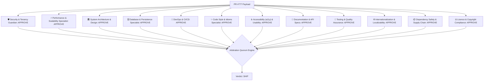

# Historical Review Comment Sample

> [!WARNING]
> **Historical sample artifact; non-authoritative.** This is not a live Review Yeti receipt and its
> static-heuristic verdict, repository identity, model roster, and counts must not be used as current
> review or release evidence. See [Documentation authority](docs/DOCUMENTATION_AUTHORITY.md).

## 🟢 **Verdict: SHIP**

### 📊 AI Review Panel Summary
- **Repository**: `review-bot/review-bot`
- **Commit SHA**: `main`
- **Review Mode**: ⚠️ Static heuristics only — no model configured, findings are regex-level
- **Parallel Personas Evaluated**: `12/12`
- **Quorum Status**: `SATISFIED`
- **MCP Server Telemetry**: Default Built-in MCP Adapters Active (Fallback Mode)
- **Total Findings**: P0: `0` | P1: `0` | P2: `0`
- **Rationale**: All 12 persona evaluation(s) passed or contained only minor nits. Quorum satisfied for release.

### 🧬 Architectural Pipeline Flow

### 📋 Persona Evaluation Roster
| Reviewer Persona | Model | Decision | Findings |
|---|---|---|---|
| 🛡️ Security & Tenancy Guardian | `openrouter/anthropic/claude-3.5-sonnet` | ✅ APPROVE | 0 |
| ⚡ Performance & Scalability Specialist | `openrouter/meta-llama/llama-3.3-70b-instruct` | ✅ APPROVE | 0 |
| 🏛️ System Architecture & Design | `openrouter/deepseek/deepseek-chat` | ✅ APPROVE | 0 |
| 🗄️ Database & Persistence Specialist | `openrouter/deepseek/deepseek-chat` | ✅ APPROVE | 0 |
| 🐳 DevOps & CI/CD | `openrouter/google/gemini-2.0-flash-lite-001` | ✅ APPROVE | 0 |
| ✨ Code Style & Idioms Specialist | `openrouter/google/gemini-2.0-flash-lite-001` | ✅ APPROVE | 0 |
| ♿ Accessibility (a11y) & Usability | `openrouter/google/gemini-2.0-flash-lite-001` | ✅ APPROVE | 0 |
| 📝 Documentation & API Specs | `openrouter/google/gemini-2.0-flash-lite-001` | ✅ APPROVE | 0 |
| 🧪 Testing & Quality Assurance | `openrouter/meta-llama/llama-3.3-70b-instruct` | ✅ APPROVE | 0 |
| 🌐 Internationalization & Localizability | `openrouter/google/gemini-2.0-flash-lite-001` | ✅ APPROVE | 0 |
| 📦 Dependency Safety & Supply Chain | `openrouter/google/gemini-2.0-flash-lite-001` | ✅ APPROVE | 0 |
| ⚖️ Licence & Copyright Compliance | `openrouter/google/gemini-2.0-flash-lite-001` | ✅ APPROVE | 0 |

> 🎉 **No issues detected across enabled reviewer personas!**
