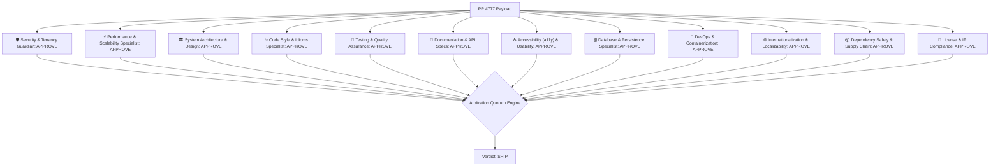

## 🟢 **Verdict: SHIP**

### 📊 PI.dev Review Quorum Summary
- **Repository**: `calltelemetry/ct-review-bot`
- **Commit SHA**: `main`
- **Default LLM Model**: `openrouter/auto`
- **Parallel Personas Evaluated**: `12/12`
- **Quorum Status**: `SATISFIED (12/12)`
- **MCP Server Telemetry**: Default Built-in MCP Adapters Active (Fallback Mode)
- **Total Findings**: P0: `0` | P1: `0` | P2: `0`
- **Rationale**: All 12 persona evaluations passed or contained only minor nits. Quorum satisfied for release.

### 🧬 Architectural Pipeline Flow

### 📋 Persona Evaluation Roster
| Reviewer Persona | Model | Decision | Findings |
|---|---|---|---|
| 🛡️ Security & Tenancy Guardian | `openrouter/auto` | ✅ APPROVE | 0 |
| ⚡ Performance & Scalability Specialist | `openrouter/auto` | ✅ APPROVE | 0 |
| 🏛️ System Architecture & Design | `openrouter/auto` | ✅ APPROVE | 0 |
| ✨ Code Style & Idioms Specialist | `openrouter/auto` | ✅ APPROVE | 0 |
| 🧪 Testing & Quality Assurance | `openrouter/auto` | ✅ APPROVE | 0 |
| 📝 Documentation & API Specs | `openrouter/auto` | ✅ APPROVE | 0 |
| ♿ Accessibility (a11y) & Usability | `openrouter/auto` | ✅ APPROVE | 0 |
| 🗄️ Database & Persistence Specialist | `openrouter/auto` | ✅ APPROVE | 0 |
| 🐳 DevOps & Containerization | `openrouter/auto` | ✅ APPROVE | 0 |
| 🌐 Internationalization & Localizability | `openrouter/auto` | ✅ APPROVE | 0 |
| 📦 Dependency Safety & Supply Chain | `openrouter/auto` | ✅ APPROVE | 0 |
| 📄 License & IP Compliance | `openrouter/auto` | ✅ APPROVE | 0 |

> 🎉 **No issues detected across enabled reviewer personas!**

---
*Powered by CallTelemetry PI.dev Review Engine & Blacksmith GitHub Action Runners*